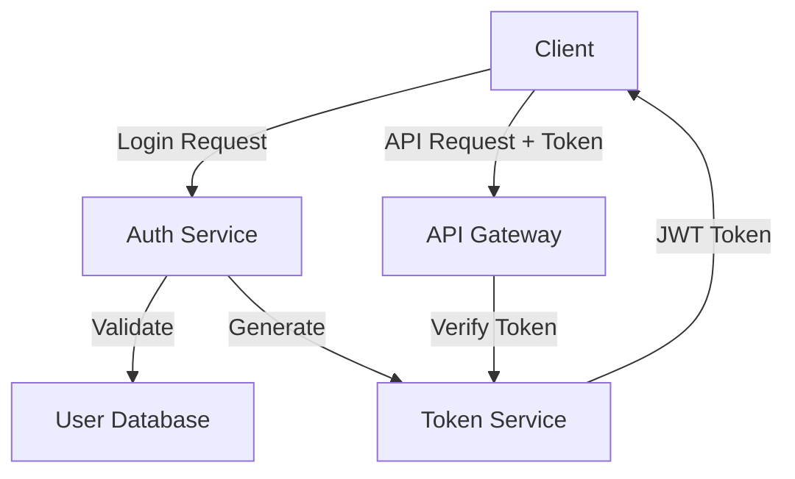

# Example Architecture: Authentication Module

---
title: Authentication Module Architecture
date: 2025-01-15
tags: [architecture, authentication, security]
status: example
---

## Overview

This is an example architecture document demonstrating the structure for system architecture documentation.

## Module Purpose

Handles user authentication and session management for the BlueMarble platform.

## Architecture Diagram

## Components

### Auth Service
- **Responsibility**: Process login/logout requests
- **Technology**: Node.js / Express
- **Scalability**: Horizontally scalable

### Token Service
- **Responsibility**: Generate and verify JWT tokens
- **Technology**: JWT library
- **Security**: Encrypted token storage

### User Database
- **Responsibility**: Store user credentials
- **Technology**: PostgreSQL
- **Security**: Password hashing with bcrypt

## Data Flow

1. User submits credentials
2. Auth Service validates against User Database
3. Token Service generates JWT token
4. Client stores token for subsequent requests
5. API Gateway verifies token on each request

## Security Considerations

- Passwords hashed using bcrypt (cost factor: 12)
- Tokens expire after 24 hours
- Refresh token mechanism for extended sessions
- Rate limiting on login attempts

## Performance Requirements

- Login response time: < 500ms
- Token verification: < 50ms
- Support: 10,000 concurrent sessions

## Related Documentation

- [Security Framework](../../docs/systems/security-framework-design.md)
- [API Specifications](../../docs/systems/api-specifications.md)

---

**Note**: This is an example file. Replace with actual architecture content.
