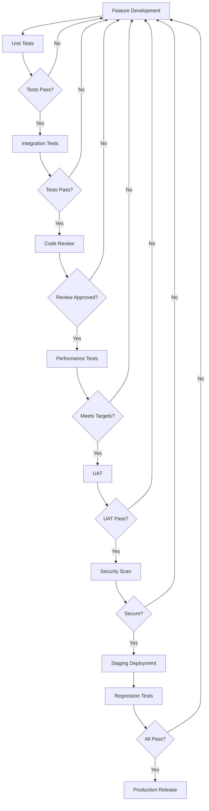

# Quality Assurance Framework

**Document Type:** QA Framework  
**Version:** 1.0  
**Author:** QA Team  
**Date:** 2025-10-01  
**Status:** Approved  

## Overview

This document establishes the comprehensive Quality Assurance (QA) framework for the BlueMarble.Design project. It defines testing methodologies, QA procedures, bug tracking processes, and quality gates to ensure all features meet the required standards before release.

## Table of Contents

- [QA Objectives](#qa-objectives)
- [Testing Strategy](#testing-strategy)
- [Test Case Documentation](#test-case-documentation)
- [Bug Tracking and Management](#bug-tracking-and-management)
- [QA Procedures](#qa-procedures)
- [Quality Gates and Success Criteria](#quality-gates-and-success-criteria)
- [Testing Tools and Infrastructure](#testing-tools-and-infrastructure)
- [Metrics and Reporting](#metrics-and-reporting)

## QA Objectives

### Primary Goals

1. **Ensure Functional Correctness:** All features work as specified in requirements documents
2. **Maintain Quality Standards:** Code, design, and documentation meet established quality benchmarks
3. **Prevent Regression:** New changes don't break existing functionality
4. **Optimize Performance:** Features meet performance and scalability requirements
5. **Enhance User Experience:** Features are intuitive, accessible, and enjoyable

### Quality Metrics

| Metric | Target | Critical Threshold |
|--------|--------|-------------------|
| Unit Test Coverage | >90% | >80% |
| Integration Test Pass Rate | 100% | >95% |
| Critical Bugs in Production | 0 | <2 |
| High-Priority Bugs | <5 | <10 |
| Performance Regression | <5% | <10% |
| Documentation Completeness | 100% | >90% |
| User Acceptance Test Pass Rate | >95% | >90% |

## Testing Strategy

### Testing Pyramid

```
        /\
       /  \      E2E Tests (10%)
      /----\     - Full system integration
     /      \    - User journey validation
    /--------\   
   / Integration\ Integration Tests (30%)
  /--------------\ - API testing
 /                \ - Component integration
/------------------\
|   Unit Tests     | Unit Tests (60%)
|    (60%)         | - Function-level testing
|                  | - Isolated component tests
--------------------
```

### Test Types and Coverage

#### 1. Unit Testing

**Purpose:** Verify individual functions, methods, and components in isolation.

**Coverage Requirements:**
- All business logic functions
- Edge cases and boundary conditions
- Error handling paths
- Data validation logic

**Example Test Cases:**
```gherkin
Feature: Coordinate Conversion
  Scenario: Convert valid spherical coordinates to cartesian
    Given a spherical coordinate with latitude 45.0, longitude 90.0, radius 6371000
    When converted to cartesian coordinates
    Then the result should have x, y, z values
    And converting back to spherical should match original within 0.001 tolerance

  Scenario: Handle invalid latitude values
    Given a spherical coordinate with latitude 91.0 (invalid)
    When attempting conversion
    Then should throw ArgumentOutOfRangeException
```

#### 2. Integration Testing

**Purpose:** Verify components work correctly together.

**Coverage Requirements:**
- API endpoint integration
- Database operations
- Third-party service integrations
- Module interactions

**Example Test Cases:**
```gherkin
Feature: Planet Generation API
  Scenario: Generate planet with valid configuration
    Given authenticated API client
    When POST /api/v1/planet/generate with valid config
    Then response status should be 202 Accepted
    And response should contain taskId and statusUrl
    And polling statusUrl should eventually return completed status

  Scenario: Retrieve generated planet data
    Given an existing planet with ID "planet-123"
    When GET /api/v1/planet/planet-123/polygons?format=geojson
    Then response status should be 200 OK
    And response should contain valid GeoJSON FeatureCollection
    And each feature should have biomeType property
```

#### 3. Performance Testing

**Purpose:** Ensure features meet performance requirements under load.

**Test Scenarios:**
- Load Testing: Simulate expected production load
- Stress Testing: Push system beyond normal capacity
- Endurance Testing: Sustained load over extended period
- Spike Testing: Sudden traffic increases

**Performance Targets:**

| Operation | Target | Maximum |
|-----------|--------|---------|
| API Response Time (p95) | <100ms | <200ms |
| Planet Generation (Earth-size) | <10min | <15min |
| Database Query Time | <50ms | <100ms |
| Concurrent Users | 10,000 | 15,000 |
| Memory Usage per Request | <50MB | <100MB |

#### 4. User Acceptance Testing (UAT)

**Purpose:** Validate features meet user expectations and requirements.

**Process:**
1. Identify user personas and scenarios
2. Create UAT test plans based on user stories
3. Conduct testing with representative users
4. Collect feedback and iterate
5. Sign-off from stakeholders

#### 5. Regression Testing

**Purpose:** Ensure new changes don't break existing functionality.

**Strategy:**
- Automated regression test suite runs on every commit
- Critical path testing for major releases
- Full regression testing before production deployment
- Monitoring of key metrics post-deployment

## Test Case Documentation

### Test Case Template

**Test Case ID:** TC-[Module]-[Number]  
**Feature:** [Feature Name]  
**Priority:** Critical / High / Medium / Low  
**Type:** Unit / Integration / Performance / UAT  

**Preconditions:**
- List setup requirements
- Required test data
- System state prerequisites

**Test Steps:**
1. Step 1 with expected result
2. Step 2 with expected result
3. Step 3 with expected result

**Expected Results:**
- Primary expected outcome
- Side effects and secondary outcomes
- Performance expectations

**Actual Results:**
- To be filled during test execution

**Status:** Pass / Fail / Blocked / Skip  
**Notes:** Additional observations  
**Tested By:** [Tester Name]  
**Test Date:** [YYYY-MM-DD]  

### Example Test Cases

#### TC-PLANET-001: Basic Planet Generation

**Test Case ID:** TC-PLANET-001  
**Feature:** Spherical Planet Generation  
**Priority:** Critical  
**Type:** Integration  

**Preconditions:**
- Database is running and accessible
- API service is deployed and healthy
- Valid authentication token available

**Test Steps:**
1. Send POST request to `/api/v1/planet/generate` with Earth-like configuration
   - Expected: Receive 202 Accepted status
2. Poll status endpoint every 5 seconds
   - Expected: Status transitions from "queued" → "processing" → "completed"
3. Retrieve generated planet data
   - Expected: Receive valid GeoJSON with >1000 polygons
4. Validate biome distribution
   - Expected: Ocean coverage ~70%, land biomes realistic distribution

**Expected Results:**
- Planet generates within 10 minutes
- All polygons have valid topology
- Biome distribution matches Earth-like parameters
- No errors in logs

**Status:** Pass  
**Notes:** Generation completed in 8m 34s, memory usage 2.1GB  
**Tested By:** QA Team  
**Test Date:** 2025-10-01  

#### TC-BIOME-002: Biome Classification Accuracy

**Test Case ID:** TC-BIOME-002  
**Feature:** Biome Classification  
**Priority:** High  
**Type:** Unit  

**Preconditions:**
- BiomeClassifier module initialized
- Test climate data loaded

**Test Steps:**
1. Test tropical rainforest classification
   - Input: Temp=26°C, Precip=2500mm, Elev=200m, Lat=5°
   - Expected: BiomeType.TropicalRainforest
2. Test desert classification
   - Input: Temp=25°C, Precip=150mm, Elev=500m, Lat=25°
   - Expected: BiomeType.Desert
3. Test tundra classification
   - Input: Temp=-8°C, Precip=300mm, Elev=100m, Lat=75°
   - Expected: BiomeType.Tundra

**Expected Results:**
- All biome classifications match expected types
- Classification completes in <1ms per point
- Edge cases handled correctly

**Status:** Pass  
**Tested By:** QA Team  
**Test Date:** 2025-10-01  

## Bug Tracking and Management

### Bug Report Template

**Bug ID:** BUG-[YYYY-MM-DD]-[Number]  
**Title:** [Concise bug description]  
**Reported By:** [Reporter Name]  
**Date Reported:** [YYYY-MM-DD]  
**Status:** New / In Progress / Fixed / Verified / Closed / Won't Fix  
**Priority:** P0 (Critical) / P1 (High) / P2 (Medium) / P3 (Low)  
**Severity:** S1 (Critical) / S2 (High) / S3 (Medium) / S4 (Low)  

**Environment:**
- Version/Build: [Version number or commit SHA]
- Platform: [OS, Browser, Device]
- Configuration: [Relevant config details]

**Steps to Reproduce:**
1. Step 1
2. Step 2
3. Step 3

**Expected Behavior:**
[What should happen]

**Actual Behavior:**
[What actually happens]

**Screenshots/Logs:**
[Attach or link to evidence]

**Impact:**
- Number of users affected
- Functionality blocked
- Business impact

**Root Cause:** [To be filled by developer]  
**Fix Description:** [To be filled by developer]  
**Fixed In:** [Version/Commit]  

### Severity Classification

#### S1 - Critical
- System crash or data loss
- Security vulnerability
- Complete feature failure
- **Response Time:** Immediate
- **Fix Time:** Same day

#### S2 - High
- Major functionality impaired
- Performance degradation >50%
- Workaround exists but difficult
- **Response Time:** <4 hours
- **Fix Time:** <3 days

#### S3 - Medium
- Minor functionality issues
- Moderate performance impact
- Easy workaround available
- **Response Time:** <1 day
- **Fix Time:** <2 weeks

#### S4 - Low
- Cosmetic issues
- Minor inconveniences
- Enhancement requests
- **Response Time:** <1 week
- **Fix Time:** Next release cycle

### Priority vs Severity Matrix

|           | S1 Critical | S2 High | S3 Medium | S4 Low |
|-----------|-------------|---------|-----------|--------|
| **Affects All Users** | P0 | P0 | P1 | P2 |
| **Affects Many Users** | P0 | P1 | P2 | P3 |
| **Affects Few Users** | P1 | P2 | P3 | P3 |
| **Single User** | P2 | P3 | P3 | P3 |

### Example Bug Reports

#### BUG-2025-10-01-001: Planet Generation Timeout

**Bug ID:** BUG-2025-10-01-001  
**Title:** Planet generation times out for large plate counts  
**Reported By:** Jane Smith  
**Date Reported:** 2025-10-01  
**Status:** Fixed  
**Priority:** P1 (High)  
**Severity:** S2 (High)  

**Environment:**
- Version: v1.2.3
- Platform: Linux Ubuntu 22.04
- Configuration: PlateCount=30, RadiusMeters=6371000

**Steps to Reproduce:**
1. Send POST /api/v1/planet/generate with PlateCount=30
2. Wait for generation to complete
3. After 20 minutes, request times out

**Expected Behavior:**
Generation should complete within 15 minutes for any valid configuration

**Actual Behavior:**
Generation hangs at tectonic plate boundary calculation and times out

**Impact:**
- Users cannot generate large, complex planets
- Affects advanced users and testing scenarios
- ~5% of generation requests affected

**Root Cause:** 
Inefficient algorithm for plate boundary detection with O(n²) complexity

**Fix Description:**
- Implemented spatial indexing for plate boundary calculation
- Reduced complexity to O(n log n)
- Added progress reporting for long-running operations

**Fixed In:** v1.2.4 (commit abc123)  

## QA Procedures

### Pre-Development Phase

**Requirement Review:**
- [ ] Requirements are clear and testable
- [ ] Acceptance criteria defined
- [ ] Test scenarios identified
- [ ] Performance targets specified
- [ ] Dependencies documented

### Development Phase

**Continuous Testing:**
- [ ] Unit tests written alongside code
- [ ] Code coverage meets threshold (>90%)
- [ ] Static analysis passes
- [ ] Code review completed
- [ ] Documentation updated

### Pre-Release Phase

**Release Testing Checklist:**
- [ ] All unit tests pass
- [ ] All integration tests pass
- [ ] Performance tests meet targets
- [ ] Security scan completed
- [ ] Regression tests pass
- [ ] UAT completed with sign-off
- [ ] Release notes prepared
- [ ] Rollback plan documented

### Post-Release Phase

**Production Monitoring:**
- [ ] Deployment successful
- [ ] Health checks passing
- [ ] Key metrics within normal range
- [ ] No critical errors in logs
- [ ] User feedback monitoring active
- [ ] Rollback plan ready if needed

### Feature Testing Workflow



## Quality Gates and Success Criteria

### Quality Gate 1: Code Complete

**Criteria:**
- [ ] All planned features implemented
- [ ] Unit test coverage >90%
- [ ] No compiler warnings
- [ ] Static analysis score >8/10
- [ ] Code review completed
- [ ] Documentation updated

**Exit Criteria:**
All criteria met OR approved exception by tech lead

### Quality Gate 2: Testing Complete

**Criteria:**
- [ ] All test cases executed
- [ ] Zero P0 bugs
- [ ] <3 P1 bugs
- [ ] Integration tests pass 100%
- [ ] Performance tests meet targets
- [ ] UAT sign-off received

**Exit Criteria:**
All criteria met OR approved exception by QA lead

### Quality Gate 3: Release Ready

**Criteria:**
- [ ] All documentation complete
- [ ] Release notes prepared
- [ ] Deployment plan reviewed
- [ ] Rollback plan tested
- [ ] Security scan passed
- [ ] Stakeholder approval received

**Exit Criteria:**
All criteria met AND product owner sign-off

### Definition of Done

**Feature Level:**
- Code complete and reviewed
- Unit tests written and passing
- Integration tests passing
- Documentation updated
- Deployed to staging
- Demo to stakeholders complete

**Release Level:**
- All features meet DoD
- Regression tests passing
- Performance benchmarks met
- Security review complete
- Release notes published
- Production deployment successful

## Testing Tools and Infrastructure

### Recommended Testing Stack

#### Unit Testing
- **Framework:** xUnit / NUnit / MSTest (for C#)
- **Mocking:** Moq / NSubstitute
- **Coverage:** Coverlet / dotCover
- **Assertion:** FluentAssertions

#### Integration Testing
- **API Testing:** RestSharp / HttpClient
- **Database:** TestContainers / In-Memory DB
- **E2E:** Selenium / Playwright / Cypress

#### Performance Testing
- **Load Testing:** K6 / JMeter / Gatling
- **Profiling:** dotMemory / dotTrace
- **Monitoring:** Application Insights / Prometheus

#### CI/CD Integration
- **Pipeline:** GitHub Actions / Azure DevOps
- **Test Reporting:** ReportGenerator / Allure
- **Quality Gates:** SonarQube / CodeClimate

### Test Environment Setup

**Development Environment:**
- Local database instance
- Mock external services
- Debug logging enabled
- Reduced dataset size

**Staging Environment:**
- Production-like configuration
- Full dataset
- Performance monitoring
- Integration with external services

**Production Environment:**
- High availability configuration
- Real-time monitoring
- Automated alerts
- Rollback capability

## Metrics and Reporting

### Key Performance Indicators (KPIs)

#### Quality Metrics
- **Defect Density:** Bugs per 1000 lines of code
- **Test Coverage:** Percentage of code covered by tests
- **Defect Removal Efficiency:** Bugs found in testing vs production
- **Mean Time to Detect (MTTD):** Time to find bugs after introduction
- **Mean Time to Resolve (MTTR):** Time to fix bugs after detection

#### Process Metrics
- **Test Execution Time:** Time to run full test suite
- **Test Pass Rate:** Percentage of tests passing
- **Build Success Rate:** Percentage of successful builds
- **Deployment Frequency:** Number of deployments per period
- **Deployment Success Rate:** Percentage of successful deployments

### Test Reporting Template

**Test Execution Report**

**Project:** [Project Name]  
**Release:** [Version]  
**Test Period:** [Start Date] - [End Date]  
**Prepared By:** [QA Lead]  

**Executive Summary:**
[Brief overview of test results and key findings]

**Test Coverage:**
- Total Test Cases: [Number]
- Executed: [Number] ([Percentage]%)
- Passed: [Number] ([Percentage]%)
- Failed: [Number] ([Percentage]%)
- Blocked: [Number] ([Percentage]%)
- Skipped: [Number] ([Percentage]%)

**Defect Summary:**
| Priority | New | Fixed | Verified | Remaining |
|----------|-----|-------|----------|-----------|
| P0       | 0   | 0     | 0        | 0         |
| P1       | 3   | 2     | 2        | 1         |
| P2       | 8   | 5     | 4        | 4         |
| P3       | 15  | 10    | 8        | 7         |

**Test Metrics:**
- Test Coverage: [Percentage]%
- Defect Density: [Number] per KLOC
- Test Execution Time: [Duration]
- Pass Rate: [Percentage]%

**Risk Assessment:**
- High Risk Issues: [Number] - [Description]
- Medium Risk Issues: [Number] - [Description]
- Blockers: [Number] - [Description]

**Recommendations:**
1. [Recommendation 1]
2. [Recommendation 2]
3. [Recommendation 3]

**Sign-off:**
- QA Lead: ________________ Date: ________
- Tech Lead: ________________ Date: ________
- Product Owner: ________________ Date: ________

## Continuous Improvement

### Review Cycles

**Post-Release Retrospective:**
- Conduct within 1 week of release
- Review what went well
- Identify improvements
- Update processes and documentation

**Quarterly QA Review:**
- Analyze trends in metrics
- Assess tooling effectiveness
- Review and update standards
- Training and skill development

### Feedback Loops

**Sources:**
1. User feedback and bug reports
2. Production monitoring and alerts
3. Team retrospectives
4. Stakeholder feedback
5. Industry best practices

**Actions:**
1. Prioritize improvements
2. Update documentation
3. Enhance test coverage
4. Improve tooling
5. Training and knowledge sharing

## References

- [Feature Specification Template](../templates/feature-specification.md)
- [Playtest Report Template](../templates/playtest-report.md)
- [Testing Strategy Example](systems/testing-spherical-planet-generation.md)
- [API Specification Template](../templates/api-specification.md)
- [Scripts and Automation](../scripts/README.md)

## Version History

| Version | Date | Author | Changes |
|---------|------|--------|---------|
| 1.0 | 2025-10-01 | QA Team | Initial comprehensive QA framework |

---

**Document Owner:** QA Team  
**Last Updated:** 2025-10-01  
**Next Review:** 2026-01-01
