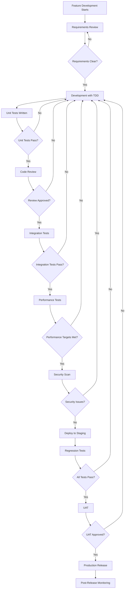
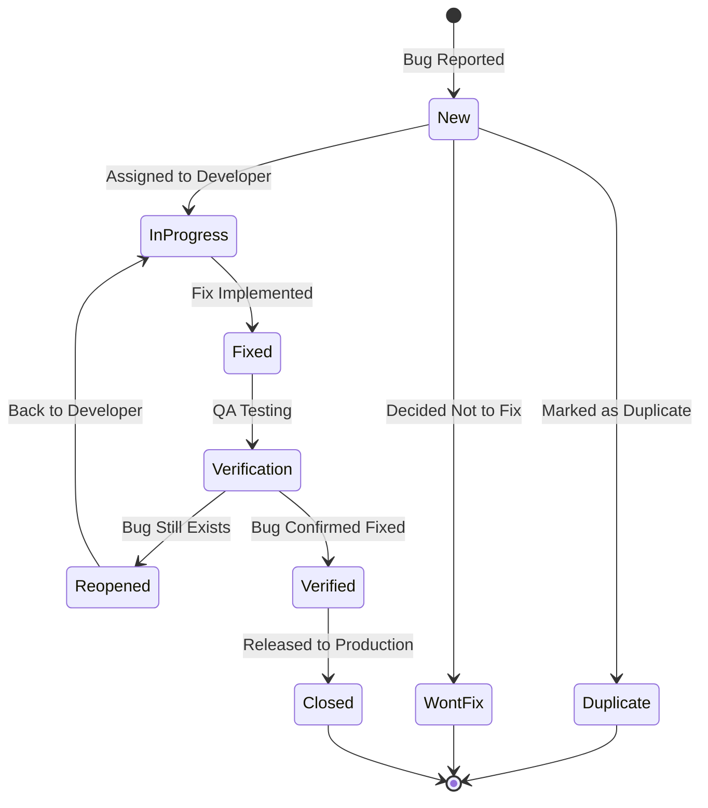
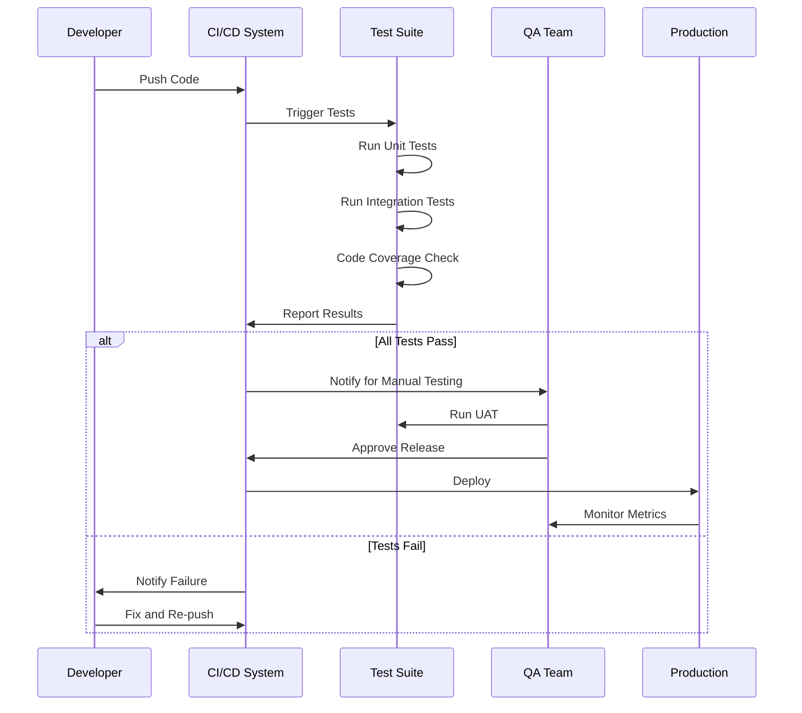
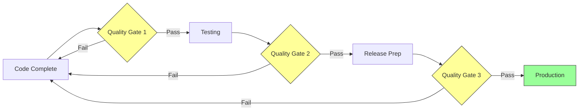
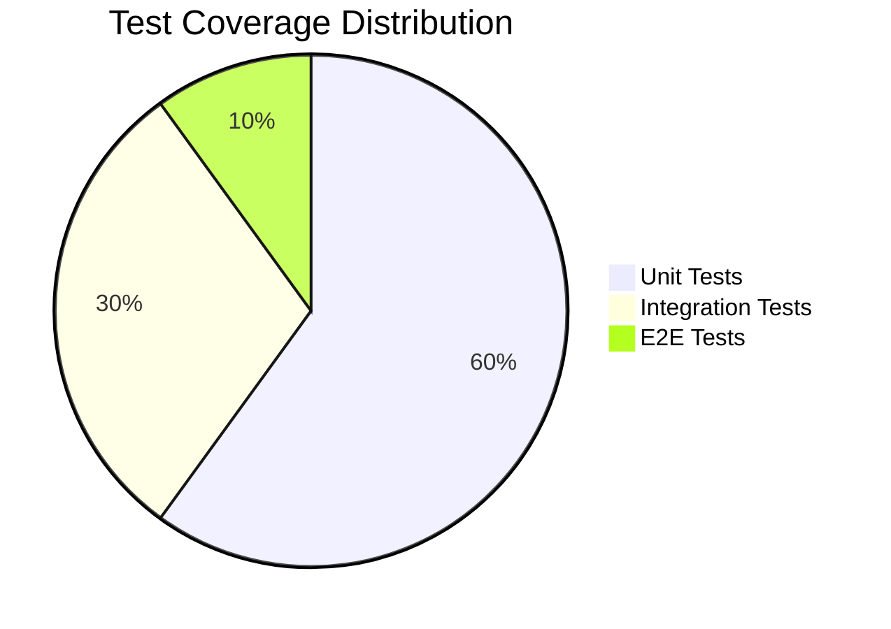
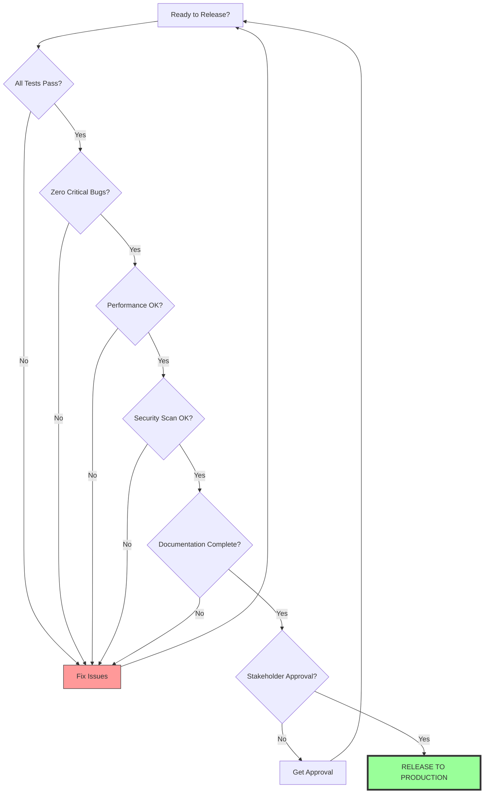
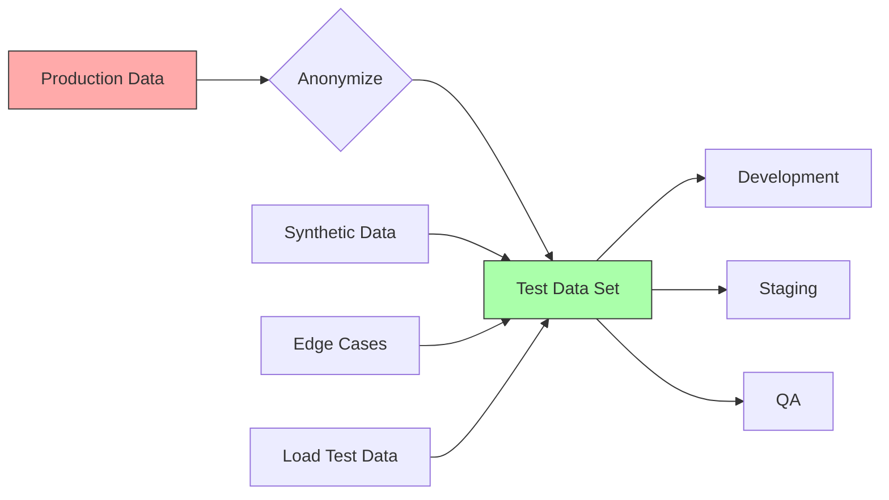

# QA Workflow and Process Diagrams

**Document Type:** Visual Guide  
**Version:** 1.0  
**Date:** 2025-10-01  
**Related:** [QA Framework](QA_FRAMEWORK.md)

## QA Workflow Overview

This document provides visual representations of the QA workflows and processes defined in the QA Framework.

## Feature Testing Workflow



## Bug Lifecycle



## Testing Pyramid

```
              /\
             /  \
            / E2E \        End-to-End Tests (10%)
           /      \        • Full user journeys
          /--------\       • Critical workflows
         /          \      • Cross-system integration
        /            \
       / Integration  \    Integration Tests (30%)
      /      Tests     \   • API testing
     /                  \  • Database integration
    /--------------------\ • Service communication
   /                      \
  /      Unit Tests        \ Unit Tests (60%)
 /                          \ • Function-level testing
/----------------------------\ • Algorithm validation
|                            | • Business logic
|                            | • Edge cases
------------------------------
```

## Test Execution Flow



## Quality Gates



### Quality Gate Details

**Gate 1: Code Complete**
- ✓ All features implemented
- ✓ Unit test coverage >90%
- ✓ Code review completed
- ✓ Documentation updated

**Gate 2: Testing Complete**
- ✓ All test cases executed
- ✓ Zero P0 bugs
- ✓ <3 P1 bugs
- ✓ Performance targets met

**Gate 3: Release Ready**
- ✓ All documentation complete
- ✓ Deployment plan reviewed
- ✓ Security scan passed
- ✓ Stakeholder approval

## Bug Severity vs Priority Matrix

```
┌─────────────────────────────────────────────────┐
│           BUG SEVERITY vs PRIORITY              │
├─────────────────────────────────────────────────┤
│                                                 │
│     SEVERITY →  S1 Critical │ S2 High │ S3 Med │ S4 Low │
│                 ────────────┼─────────┼────────┼────────┤
│  IMPACT ↓                   │         │        │        │
│                             │         │        │        │
│  All Users      P0          │  P0     │  P1    │  P2    │
│  (100%)         🔴          │  🔴     │  🟠    │  🟡    │
│                             │         │        │        │
│  Many Users     P0          │  P1     │  P2    │  P3    │
│  (>25%)         🔴          │  🟠     │  🟡    │  🟢    │
│                             │         │        │        │
│  Few Users      P1          │  P2     │  P3    │  P3    │
│  (5-25%)        🟠          │  🟡     │  🟢    │  🟢    │
│                             │         │        │        │
│  Single User    P2          │  P3     │  P3    │  P3    │
│  (<5%)          🟡          │  🟢     │  🟢    │  🟢    │
│                             │         │        │        │
└─────────────────────────────────────────────────┘

Legend:
🔴 P0 - Critical (Immediate action)
🟠 P1 - High (Fix within 3 days)
🟡 P2 - Medium (Fix within 2 weeks)
🟢 P3 - Low (Next release)
```

## Test Coverage Strategy



## Release Decision Tree



## Performance Testing Stages

```
Stage 1: Baseline          Stage 2: Load           Stage 3: Stress
┌──────────────┐          ┌──────────────┐         ┌──────────────┐
│              │          │      ↗       │         │       ↗↗     │
│     ───      │          │    ↗         │         │     ↗↗       │
│   ─          │          │  ↗           │         │   ↗↗         │
│ ─            │          │↗             │         │ ↗↗  ↘        │
└──────────────┘          └──────────────┘         └─────↘↘↘──────┘
Normal load              Expected load            Beyond capacity
Establish baseline       Validate targets         Find breaking point
```

## Continuous Testing Pipeline

```
┌─────────────────────────────────────────────────────────────────┐
│                    CONTINUOUS TESTING PIPELINE                  │
├─────────────────────────────────────────────────────────────────┤
│                                                                 │
│  Developer → Commit → CI Trigger → Tests → Quality Gates       │
│      ↓                                ↓           ↓             │
│    Local       ┌──────────────┐   ┌──────┐   ┌──────┐         │
│   Testing      │  Unit Tests  │   │ SCA  │   │Gate 1│         │
│                │  (Fast)      │   │      │   │      │         │
│                └──────────────┘   └──────┘   └──────┘         │
│                       ↓                          ↓              │
│                ┌──────────────┐              ┌──────┐          │
│                │ Integration  │              │Gate 2│          │
│                │ Tests        │              │      │          │
│                └──────────────┘              └──────┘          │
│                       ↓                          ↓              │
│                ┌──────────────┐              ┌──────┐          │
│                │ Performance  │              │Gate 3│          │
│                │ Tests        │              │      │          │
│                └──────────────┘              └──────┘          │
│                       ↓                          ↓              │
│                ┌──────────────┐            Deploy to           │
│                │  Security    │            Production          │
│                │  Scan        │                                │
│                └──────────────┘                                │
│                                                                 │
│  Time:    <5min     <15min      <30min      <1hr              │
│  Cost:    Low       Medium      High        Very High         │
│  Value:   High      High        Medium      Critical          │
└─────────────────────────────────────────────────────────────────┘
```

## Test Data Management Flow



## Defect Trend Analysis

```
Defects Over Time
│
│  ┌──┐
│  │  │        ┌──┐
│  │  │  ┌──┐  │  │
│  │  │  │  │  │  │  ┌──┐
│  │  │  │  │  │  │  │  │  ┌──┐
│  │S1│  │S1│  │S1│  │S1│  │S1│
│  ├──┤  ├──┤  ├──┤  ├──┤  ├──┤
│  │S2│  │S2│  │S2│  │S2│  │S2│
│  ├──┤  ├──┤  ├──┤  ├──┤  ├──┤
│  │S3│  │S3│  │S3│  │S3│  │S3│
│  ├──┤  ├──┤  ├──┤  ├──┤  ├──┤
│  │S4│  │S4│  │S4│  │S4│  │S4│
└──┴──┴──┴──┴──┴──┴──┴──┴──┴──┴──→
   W1   W2   W3   W4   W5    Week

Target: Decreasing trend in S1/S2
        Stable or decreasing overall
```

## Test Automation Roadmap

```
Phase 1: Foundation       Phase 2: Integration      Phase 3: Advanced
(0-3 months)             (3-6 months)              (6-12 months)
──────────────           ──────────────            ──────────────
• Unit test framework    • API test automation     • Performance testing
• Basic CI/CD            • Database testing        • Load testing
• Code coverage          • Service integration     • Chaos engineering
• Static analysis        • Contract testing        • Visual regression
                         • E2E critical paths      • AI-assisted testing
```

## Resource Allocation

```
QA Team Resource Distribution
┌────────────────────────────────────────┐
│                                        │
│  Test Planning         ███ 15%        │
│  Test Case Writing     █████ 25%      │
│  Test Execution        ████████ 40%   │
│  Bug Investigation     ███ 15%        │
│  Reporting             █ 5%           │
│                                        │
└────────────────────────────────────────┘
```

## Risk Assessment Matrix

```
                    IMPACT
                    High  │ Medium │  Low
              ──────┼─────────┼─────────┼──────
              High  │    🔴   │   🟠    │  🟡
PROBABILITY         │         │         │
              ──────┼─────────┼─────────┼──────
              Med   │    🟠   │   🟡    │  🟢
                    │         │         │
              ──────┼─────────┼─────────┼──────
              Low   │    🟡   │   🟢    │  🟢

Risk Response:
🔴 Immediate mitigation required
🟠 Mitigation plan needed
🟡 Monitor closely
🟢 Accept risk
```

## Metrics Dashboard Layout

```
┌─────────────────────────────────────────────────────────────┐
│                      QA METRICS DASHBOARD                    │
├─────────────────────────────────────────────────────────────┤
│                                                              │
│  Test Coverage        Defect Density      Pass Rate         │
│  ┌──────────┐        ┌──────────┐        ┌──────────┐      │
│  │   94%    │        │ 2.3/KLOC │        │   98.5%  │      │
│  │  ████░░  │        │    ↓ 15% │        │  █████░  │      │
│  └──────────┘        └──────────┘        └──────────┘      │
│                                                              │
│  Open Bugs           MTTR               Build Success       │
│  ┌──────────┐        ┌──────────┐        ┌──────────┐      │
│  │ S1: 0    │        │  4.2 hrs │        │   96%    │      │
│  │ S2: 2    │        │    ↓ 20% │        │  █████░  │      │
│  │ S3: 7    │        │          │        │          │      │
│  │ S4: 15   │        │          │        │          │      │
│  └──────────┘        └──────────┘        └──────────┘      │
│                                                              │
└─────────────────────────────────────────────────────────────┘
```

## Summary

These diagrams provide visual representations of the key QA processes and workflows defined in the QA Framework. They serve as quick references for understanding:

- Feature testing workflow and decision points
- Bug lifecycle and state transitions
- Testing pyramid and coverage strategy
- Quality gates and release criteria
- Performance testing stages
- Continuous testing pipeline
- Risk assessment and prioritization

For detailed procedures and templates, refer to:
- [QA Framework](QA_FRAMEWORK.md)
- [QA Test Plan Template](../templates/qa-test-plan.md)
- [Example QA Test Plan](systems/qa-test-plan-spherical-planet.md)

---

**Document Owner:** QA Team  
**Last Updated:** 2025-10-01  
**Next Review:** 2026-01-01
