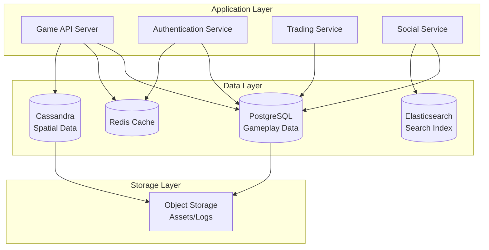
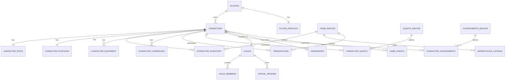

# BlueMarble Database Schema Design

**Document Type:** System Design  
**Status:** In Review  
**Priority:** High  
**Last Updated:** 2024-12-29  
**Owner:** Database Architecture Team

## Executive Summary

This document defines the comprehensive database schema design for BlueMarble, a top-down MMORPG with planetary-scale spatial data requirements. The schema supports core gameplay systems, player progression, social features, economic systems, and petabyte-scale 3D octree spatial data storage. The design prioritizes scalability, consistency, and performance while maintaining data integrity across distributed systems.

### Key Design Decisions

- **Hybrid Database Architecture**: Combination of PostgreSQL (relational gameplay data) and Cassandra + Redis (spatial data)
- **Normalization Strategy**: 3NF for transactional data, denormalized for high-read spatial queries
- **Scalability Approach**: Horizontal scaling with sharding for gameplay data, distributed octree for spatial data
- **Performance Targets**: <10ms for gameplay queries, <1ms for cached spatial queries, <50ms for complex transactions

## Table of Contents

1. [Architecture Overview](#architecture-overview)
2. [Core Game Systems Schema](#core-game-systems-schema)
3. [Spatial Data Storage Schema](#spatial-data-storage-schema)
4. [Normalization Strategy](#normalization-strategy)
5. [Relationships and Constraints](#relationships-and-constraints)
6. [Scalability Considerations](#scalability-considerations)
7. [Performance Optimization](#performance-optimization)
8. [Migration Strategy](#migration-strategy)
9. [Security and Access Control](#security-and-access-control)
10. [Monitoring and Maintenance](#monitoring-and-maintenance)

## Architecture Overview

### Database Technology Stack

```yaml
relational_database:
  technology: "PostgreSQL 15+"
  purpose: "Core gameplay data (players, items, transactions)"
  deployment: "Primary-replica with read replicas"
  scaling: "Vertical + horizontal sharding"
  
spatial_database:
  technology: "Apache Cassandra 4.0+"
  purpose: "3D octree spatial data storage"
  deployment: "Distributed cluster with RF=3"
  scaling: "Linear horizontal scaling"
  
cache_layer:
  technology: "Redis Cluster 7.0+"
  purpose: "Hot data caching, session management"
  deployment: "Clustered with replicas"
  scaling: "Horizontal with sharding"
  
search_index:
  technology: "Elasticsearch 8.0+"
  purpose: "Full-text search for items, guilds, players"
  deployment: "Clustered deployment"
  scaling: "Horizontal scaling"
```

### High-Level Architecture Diagram



## Core Game Systems Schema

### 1. Player Management

#### Players Table

```sql
-- PostgreSQL Schema
CREATE TABLE players (
    player_id BIGSERIAL PRIMARY KEY,
    account_id UUID NOT NULL UNIQUE,
    username VARCHAR(50) NOT NULL UNIQUE,
    email VARCHAR(255) NOT NULL UNIQUE,
    password_hash VARCHAR(255) NOT NULL,
    created_at TIMESTAMP WITH TIME ZONE NOT NULL DEFAULT NOW(),
    last_login TIMESTAMP WITH TIME ZONE,
    total_playtime_seconds BIGINT DEFAULT 0,
    is_banned BOOLEAN DEFAULT FALSE,
    ban_reason TEXT,
    ban_expires_at TIMESTAMP WITH TIME ZONE,
    CONSTRAINT username_format CHECK (username ~ '^[a-zA-Z0-9_-]{3,50}$'),
    CONSTRAINT email_format CHECK (email ~ '^[a-zA-Z0-9._%+-]+@[a-zA-Z0-9.-]+\.[a-zA-Z]{2,}$')
);

CREATE INDEX idx_players_account_id ON players(account_id);
CREATE INDEX idx_players_username ON players(username);
CREATE INDEX idx_players_email ON players(email);
CREATE INDEX idx_players_last_login ON players(last_login);
```

#### Player Profiles Table

```sql
CREATE TABLE player_profiles (
    player_id BIGINT PRIMARY KEY REFERENCES players(player_id) ON DELETE CASCADE,
    display_name VARCHAR(100),
    bio TEXT,
    avatar_url VARCHAR(500),
    preferred_language VARCHAR(10) DEFAULT 'en',
    timezone VARCHAR(50),
    privacy_settings JSONB DEFAULT '{"show_online": true, "allow_friend_requests": true}'::jsonb,
    achievement_points INT DEFAULT 0,
    reputation_score INT DEFAULT 0,
    updated_at TIMESTAMP WITH TIME ZONE DEFAULT NOW()
);

CREATE INDEX idx_player_profiles_reputation ON player_profiles(reputation_score DESC);
CREATE INDEX idx_player_profiles_achievement ON player_profiles(achievement_points DESC);
```

### 2. Character Management

#### Characters Table

```sql
CREATE TABLE characters (
    character_id BIGSERIAL PRIMARY KEY,
    player_id BIGINT NOT NULL REFERENCES players(player_id) ON DELETE CASCADE,
    name VARCHAR(50) NOT NULL,
    class VARCHAR(30) NOT NULL,
    level INT NOT NULL DEFAULT 1,
    experience_points BIGINT DEFAULT 0,
    created_at TIMESTAMP WITH TIME ZONE NOT NULL DEFAULT NOW(),
    last_played TIMESTAMP WITH TIME ZONE,
    total_playtime_seconds BIGINT DEFAULT 0,
    is_active BOOLEAN DEFAULT TRUE,
    deleted_at TIMESTAMP WITH TIME ZONE,
    CONSTRAINT character_name_format CHECK (name ~ '^[a-zA-Z0-9_-]{3,50}$'),
    CONSTRAINT level_range CHECK (level >= 1 AND level <= 100),
    CONSTRAINT unique_active_character_name UNIQUE (name) WHERE deleted_at IS NULL
);

CREATE INDEX idx_characters_player_id ON characters(player_id);
CREATE INDEX idx_characters_level ON characters(level DESC);
CREATE INDEX idx_characters_class ON characters(class);
CREATE INDEX idx_characters_last_played ON characters(last_played DESC);
```

#### Character Stats Table

```sql
CREATE TABLE character_stats (
    character_id BIGINT PRIMARY KEY REFERENCES characters(character_id) ON DELETE CASCADE,
    health_current INT NOT NULL,
    health_max INT NOT NULL,
    mana_current INT NOT NULL,
    mana_max INT NOT NULL,
    stamina_current INT NOT NULL,
    stamina_max INT NOT NULL,
    strength INT DEFAULT 10,
    agility INT DEFAULT 10,
    intelligence INT DEFAULT 10,
    vitality INT DEFAULT 10,
    luck INT DEFAULT 10,
    attack_power INT GENERATED ALWAYS AS (strength * 2 + agility) STORED,
    defense_rating INT GENERATED ALWAYS AS (vitality * 3) STORED,
    magic_power INT GENERATED ALWAYS AS (intelligence * 2) STORED,
    critical_chance DECIMAL(5,2) GENERATED ALWAYS AS (LEAST(luck * 0.1, 50.0)) STORED,
    updated_at TIMESTAMP WITH TIME ZONE DEFAULT NOW(),
    CONSTRAINT positive_stats CHECK (
        health_max > 0 AND mana_max > 0 AND stamina_max > 0 AND
        strength > 0 AND agility > 0 AND intelligence > 0 AND vitality > 0 AND luck > 0
    )
);
```

#### Character Positions Table

```sql
CREATE TABLE character_positions (
    character_id BIGINT PRIMARY KEY REFERENCES characters(character_id) ON DELETE CASCADE,
    position_x DOUBLE PRECISION NOT NULL,
    position_y DOUBLE PRECISION NOT NULL,
    position_z DOUBLE PRECISION NOT NULL,
    rotation_yaw DOUBLE PRECISION DEFAULT 0,
    rotation_pitch DOUBLE PRECISION DEFAULT 0,
    zone_id INT NOT NULL,
    instance_id UUID,
    updated_at TIMESTAMP WITH TIME ZONE DEFAULT NOW(),
    CONSTRAINT valid_coordinates CHECK (
        position_x BETWEEN -20000000 AND 20000000 AND
        position_y BETWEEN -10000000 AND 10000000 AND
        position_z BETWEEN -10000000 AND 10000000
    )
);

CREATE INDEX idx_character_positions_zone ON character_positions(zone_id);
CREATE INDEX idx_character_positions_instance ON character_positions(instance_id);
CREATE INDEX idx_character_positions_coords ON character_positions(position_x, position_y, position_z);
```

### 3. Inventory and Items

#### Items Master Table

```sql
CREATE TABLE items_master (
    item_id INT PRIMARY KEY,
    item_name VARCHAR(100) NOT NULL,
    item_type VARCHAR(50) NOT NULL,
    rarity VARCHAR(20) NOT NULL,
    description TEXT,
    base_value INT DEFAULT 0,
    max_stack_size INT DEFAULT 1,
    is_tradeable BOOLEAN DEFAULT TRUE,
    is_consumable BOOLEAN DEFAULT FALSE,
    required_level INT DEFAULT 1,
    weight DECIMAL(10,2) DEFAULT 0,
    icon_url VARCHAR(500),
    properties JSONB,
    created_at TIMESTAMP WITH TIME ZONE DEFAULT NOW(),
    CONSTRAINT valid_rarity CHECK (rarity IN ('common', 'uncommon', 'rare', 'epic', 'legendary', 'mythic')),
    CONSTRAINT valid_item_type CHECK (item_type IN ('weapon', 'armor', 'consumable', 'material', 'quest', 'misc'))
);

CREATE INDEX idx_items_type ON items_master(item_type);
CREATE INDEX idx_items_rarity ON items_master(rarity);
CREATE INDEX idx_items_name ON items_master(item_name);
```

#### Character Inventory Table

```sql
CREATE TABLE character_inventory (
    inventory_slot_id BIGSERIAL PRIMARY KEY,
    character_id BIGINT NOT NULL REFERENCES characters(character_id) ON DELETE CASCADE,
    item_id INT NOT NULL REFERENCES items_master(item_id),
    quantity INT NOT NULL DEFAULT 1,
    slot_position INT NOT NULL,
    is_equipped BOOLEAN DEFAULT FALSE,
    acquired_at TIMESTAMP WITH TIME ZONE DEFAULT NOW(),
    durability_current INT,
    durability_max INT,
    enchantment_level INT DEFAULT 0,
    custom_properties JSONB,
    CONSTRAINT positive_quantity CHECK (quantity > 0),
    CONSTRAINT valid_slot CHECK (slot_position >= 0 AND slot_position < 200),
    CONSTRAINT unique_equipped_slot UNIQUE (character_id, slot_position)
);

CREATE INDEX idx_inventory_character ON character_inventory(character_id);
CREATE INDEX idx_inventory_item ON character_inventory(item_id);
CREATE INDEX idx_inventory_equipped ON character_inventory(character_id, is_equipped) WHERE is_equipped = TRUE;
```

#### Character Equipment Table

```sql
CREATE TABLE character_equipment (
    character_id BIGINT NOT NULL REFERENCES characters(character_id) ON DELETE CASCADE,
    equipment_slot VARCHAR(30) NOT NULL,
    inventory_slot_id BIGINT REFERENCES character_inventory(inventory_slot_id) ON DELETE SET NULL,
    equipped_at TIMESTAMP WITH TIME ZONE DEFAULT NOW(),
    PRIMARY KEY (character_id, equipment_slot),
    CONSTRAINT valid_equipment_slot CHECK (equipment_slot IN (
        'head', 'chest', 'legs', 'feet', 'hands', 'main_hand', 'off_hand', 
        'ring_1', 'ring_2', 'amulet', 'belt', 'back'
    ))
);

CREATE INDEX idx_equipment_slot_id ON character_equipment(inventory_slot_id);
```

### 4. Economy and Trading

#### Currencies Table

```sql
CREATE TABLE character_currencies (
    character_id BIGINT NOT NULL REFERENCES characters(character_id) ON DELETE CASCADE,
    currency_type VARCHAR(30) NOT NULL,
    amount BIGINT NOT NULL DEFAULT 0,
    PRIMARY KEY (character_id, currency_type),
    CONSTRAINT positive_currency CHECK (amount >= 0),
    CONSTRAINT valid_currency_type CHECK (currency_type IN ('gold', 'gems', 'pvp_tokens', 'event_currency'))
);

CREATE INDEX idx_currencies_character ON character_currencies(character_id);
```

#### Transactions Table

```sql
CREATE TABLE transactions (
    transaction_id BIGSERIAL PRIMARY KEY,
    transaction_type VARCHAR(30) NOT NULL,
    from_character_id BIGINT REFERENCES characters(character_id),
    to_character_id BIGINT REFERENCES characters(character_id),
    currency_type VARCHAR(30),
    currency_amount BIGINT,
    item_id INT REFERENCES items_master(item_id),
    item_quantity INT,
    transaction_status VARCHAR(20) NOT NULL DEFAULT 'pending',
    created_at TIMESTAMP WITH TIME ZONE DEFAULT NOW(),
    completed_at TIMESTAMP WITH TIME ZONE,
    metadata JSONB,
    CONSTRAINT valid_transaction_type CHECK (transaction_type IN (
        'trade', 'purchase', 'sale', 'quest_reward', 'drop', 'craft', 'auction', 'mail'
    )),
    CONSTRAINT valid_status CHECK (transaction_status IN ('pending', 'completed', 'cancelled', 'failed'))
);

CREATE INDEX idx_transactions_from ON transactions(from_character_id, created_at DESC);
CREATE INDEX idx_transactions_to ON transactions(to_character_id, created_at DESC);
CREATE INDEX idx_transactions_status ON transactions(transaction_status);
CREATE INDEX idx_transactions_type ON transactions(transaction_type);
```

#### Marketplace Listings Table

```sql
CREATE TABLE marketplace_listings (
    listing_id BIGSERIAL PRIMARY KEY,
    seller_character_id BIGINT NOT NULL REFERENCES characters(character_id) ON DELETE CASCADE,
    item_id INT NOT NULL REFERENCES items_master(item_id),
    quantity INT NOT NULL,
    price_per_unit BIGINT NOT NULL,
    currency_type VARCHAR(30) NOT NULL DEFAULT 'gold',
    listed_at TIMESTAMP WITH TIME ZONE DEFAULT NOW(),
    expires_at TIMESTAMP WITH TIME ZONE NOT NULL,
    status VARCHAR(20) DEFAULT 'active',
    buyer_character_id BIGINT REFERENCES characters(character_id),
    sold_at TIMESTAMP WITH TIME ZONE,
    CONSTRAINT positive_price CHECK (price_per_unit > 0),
    CONSTRAINT positive_quantity CHECK (quantity > 0),
    CONSTRAINT valid_listing_status CHECK (status IN ('active', 'sold', 'expired', 'cancelled'))
);

CREATE INDEX idx_marketplace_seller ON marketplace_listings(seller_character_id);
CREATE INDEX idx_marketplace_item ON marketplace_listings(item_id, status) WHERE status = 'active';
CREATE INDEX idx_marketplace_expires ON marketplace_listings(expires_at) WHERE status = 'active';
```

### 5. Social Systems

#### Guilds Table

```sql
CREATE TABLE guilds (
    guild_id BIGSERIAL PRIMARY KEY,
    guild_name VARCHAR(100) NOT NULL UNIQUE,
    guild_tag VARCHAR(10) NOT NULL UNIQUE,
    leader_character_id BIGINT NOT NULL REFERENCES characters(character_id),
    description TEXT,
    created_at TIMESTAMP WITH TIME ZONE DEFAULT NOW(),
    level INT DEFAULT 1,
    experience_points BIGINT DEFAULT 0,
    max_members INT DEFAULT 50,
    guild_bank_gold BIGINT DEFAULT 0,
    banner_url VARCHAR(500),
    is_recruiting BOOLEAN DEFAULT TRUE,
    CONSTRAINT valid_guild_tag CHECK (guild_tag ~ '^[A-Z0-9]{2,10}$'),
    CONSTRAINT positive_members CHECK (max_members > 0)
);

CREATE INDEX idx_guilds_name ON guilds(guild_name);
CREATE INDEX idx_guilds_tag ON guilds(guild_tag);
CREATE INDEX idx_guilds_leader ON guilds(leader_character_id);
```

#### Guild Members Table

```sql
CREATE TABLE guild_members (
    guild_id BIGINT NOT NULL REFERENCES guilds(guild_id) ON DELETE CASCADE,
    character_id BIGINT NOT NULL REFERENCES characters(character_id) ON DELETE CASCADE,
    rank VARCHAR(30) NOT NULL DEFAULT 'member',
    joined_at TIMESTAMP WITH TIME ZONE DEFAULT NOW(),
    contribution_points INT DEFAULT 0,
    permissions JSONB DEFAULT '{"invite": false, "kick": false, "bank": false}'::jsonb,
    PRIMARY KEY (guild_id, character_id),
    CONSTRAINT valid_rank CHECK (rank IN ('leader', 'officer', 'veteran', 'member', 'recruit'))
);

CREATE INDEX idx_guild_members_character ON guild_members(character_id);
CREATE INDEX idx_guild_members_rank ON guild_members(guild_id, rank);
```

#### Friends Table

```sql
CREATE TABLE friendships (
    friendship_id BIGSERIAL PRIMARY KEY,
    character_id_1 BIGINT NOT NULL REFERENCES characters(character_id) ON DELETE CASCADE,
    character_id_2 BIGINT NOT NULL REFERENCES characters(character_id) ON DELETE CASCADE,
    status VARCHAR(20) NOT NULL DEFAULT 'pending',
    requested_by BIGINT NOT NULL,
    requested_at TIMESTAMP WITH TIME ZONE DEFAULT NOW(),
    accepted_at TIMESTAMP WITH TIME ZONE,
    CONSTRAINT valid_friendship CHECK (character_id_1 < character_id_2),
    CONSTRAINT valid_friend_status CHECK (status IN ('pending', 'accepted', 'blocked')),
    CONSTRAINT valid_requester CHECK (requested_by IN (character_id_1, character_id_2)),
    UNIQUE (character_id_1, character_id_2)
);

CREATE INDEX idx_friendships_character1 ON friendships(character_id_1, status);
CREATE INDEX idx_friendships_character2 ON friendships(character_id_2, status);
```

### 6. Quests and Achievements

#### Quests Master Table

```sql
CREATE TABLE quests_master (
    quest_id INT PRIMARY KEY,
    quest_name VARCHAR(200) NOT NULL,
    description TEXT,
    quest_type VARCHAR(30) NOT NULL,
    required_level INT DEFAULT 1,
    prerequisites JSONB,
    rewards JSONB,
    objectives JSONB NOT NULL,
    is_repeatable BOOLEAN DEFAULT FALSE,
    cooldown_seconds INT,
    CONSTRAINT valid_quest_type CHECK (quest_type IN ('main', 'side', 'daily', 'weekly', 'event'))
);

CREATE INDEX idx_quests_type ON quests_master(quest_type);
CREATE INDEX idx_quests_level ON quests_master(required_level);
```

#### Character Quests Table

```sql
CREATE TABLE character_quests (
    character_quest_id BIGSERIAL PRIMARY KEY,
    character_id BIGINT NOT NULL REFERENCES characters(character_id) ON DELETE CASCADE,
    quest_id INT NOT NULL REFERENCES quests_master(quest_id),
    status VARCHAR(20) NOT NULL DEFAULT 'in_progress',
    started_at TIMESTAMP WITH TIME ZONE DEFAULT NOW(),
    completed_at TIMESTAMP WITH TIME ZONE,
    abandoned_at TIMESTAMP WITH TIME ZONE,
    progress JSONB DEFAULT '{}'::jsonb,
    completion_count INT DEFAULT 0,
    last_completed_at TIMESTAMP WITH TIME ZONE,
    CONSTRAINT valid_quest_status CHECK (status IN ('in_progress', 'completed', 'abandoned', 'failed'))
);

CREATE INDEX idx_character_quests_character ON character_quests(character_id, status);
CREATE INDEX idx_character_quests_quest ON character_quests(quest_id);
```

#### Achievements Master Table

```sql
CREATE TABLE achievements_master (
    achievement_id INT PRIMARY KEY,
    achievement_name VARCHAR(200) NOT NULL,
    description TEXT,
    category VARCHAR(50) NOT NULL,
    points INT NOT NULL DEFAULT 10,
    icon_url VARCHAR(500),
    criteria JSONB NOT NULL,
    is_hidden BOOLEAN DEFAULT FALSE,
    CONSTRAINT positive_points CHECK (points > 0)
);

CREATE INDEX idx_achievements_category ON achievements_master(category);
```

#### Character Achievements Table

```sql
CREATE TABLE character_achievements (
    character_id BIGINT NOT NULL REFERENCES characters(character_id) ON DELETE CASCADE,
    achievement_id INT NOT NULL REFERENCES achievements_master(achievement_id),
    unlocked_at TIMESTAMP WITH TIME ZONE DEFAULT NOW(),
    progress JSONB DEFAULT '{}'::jsonb,
    PRIMARY KEY (character_id, achievement_id)
);

CREATE INDEX idx_character_achievements_unlocked ON character_achievements(unlocked_at DESC);
```

### 7. Game Events and Logs

#### Game Events Table

```sql
CREATE TABLE game_events (
    event_id BIGSERIAL PRIMARY KEY,
    event_type VARCHAR(50) NOT NULL,
    character_id BIGINT REFERENCES characters(character_id) ON DELETE SET NULL,
    event_data JSONB NOT NULL,
    created_at TIMESTAMP WITH TIME ZONE DEFAULT NOW(),
    severity VARCHAR(20) DEFAULT 'info',
    CONSTRAINT valid_severity CHECK (severity IN ('debug', 'info', 'warning', 'error', 'critical'))
);

CREATE INDEX idx_game_events_type ON game_events(event_type, created_at DESC);
CREATE INDEX idx_game_events_character ON game_events(character_id, created_at DESC);
CREATE INDEX idx_game_events_created ON game_events(created_at DESC);
-- Partitioning by month for performance
CREATE INDEX idx_game_events_severity ON game_events(severity, created_at DESC);
```

## Spatial Data Storage Schema

### Cassandra Schema for 3D Octree Storage

The spatial data storage builds on the comprehensive research documented in the [Database Migration Strategy](../../research/spatial-data-storage/database-migration-strategy.md) and [Database Deployment Guidelines](../../research/spatial-data-storage/database-deployment-operational-guidelines.md).

#### Octree Nodes Table

```cql
-- Cassandra Schema
CREATE KEYSPACE IF NOT EXISTS bluemarble
WITH replication = {
  'class': 'NetworkTopologyStrategy',
  'datacenter1': 3,
  'datacenter2': 3
}
AND durable_writes = true;

USE bluemarble;

-- Primary octree storage table
CREATE TABLE IF NOT EXISTS octree_nodes (
    morton_code BIGINT,
    level TINYINT,
    material_id INT,
    homogeneity FLOAT,
    children_mask TINYINT,
    compressed_data BLOB,
    last_modified TIMESTAMP,
    PRIMARY KEY ((morton_code, level))
) WITH compression = {'class': 'LZ4Compressor'}
  AND compaction = {
    'class': 'LeveledCompactionStrategy',
    'sstable_size_in_mb': 256
  }
  AND gc_grace_seconds = 86400
  AND comment = 'Primary octree node storage with Morton code spatial indexing';

-- Secondary index for material queries
CREATE INDEX IF NOT EXISTS idx_material_id 
ON octree_nodes (material_id);

-- Secondary index for temporal queries
CREATE INDEX IF NOT EXISTS idx_last_modified
ON octree_nodes (last_modified);
```

#### Material Definitions Table

```cql
CREATE TABLE IF NOT EXISTS materials (
    material_id INT PRIMARY KEY,
    material_name TEXT,
    material_type TEXT,
    density FLOAT,
    hardness FLOAT,
    properties MAP<TEXT, TEXT>,
    render_shader TEXT,
    texture_url TEXT,
    created_at TIMESTAMP
) WITH comment = 'Material definitions for octree nodes';
```

#### Spatial Regions Table

```cql
CREATE TABLE IF NOT EXISTS spatial_regions (
    region_id UUID,
    region_name TEXT,
    bounds_min_x DOUBLE,
    bounds_min_y DOUBLE,
    bounds_min_z DOUBLE,
    bounds_max_x DOUBLE,
    bounds_max_y DOUBLE,
    bounds_max_z DOUBLE,
    zone_id INT,
    is_protected BOOLEAN,
    owner_guild_id BIGINT,
    metadata MAP<TEXT, TEXT>,
    PRIMARY KEY (region_id)
) WITH comment = 'Named spatial regions for gameplay';

CREATE INDEX IF NOT EXISTS idx_regions_zone
ON spatial_regions (zone_id);
```

#### Delta Changes Table

```cql
CREATE TABLE IF NOT EXISTS octree_deltas (
    session_id UUID,
    character_id BIGINT,
    morton_code BIGINT,
    level TINYINT,
    change_type TEXT,
    old_material_id INT,
    new_material_id INT,
    timestamp TIMESTAMP,
    is_committed BOOLEAN,
    PRIMARY KEY ((session_id), timestamp, morton_code, level)
) WITH CLUSTERING ORDER BY (timestamp DESC)
  AND gc_grace_seconds = 604800
  AND comment = 'Player modification deltas for octree';

CREATE INDEX IF NOT EXISTS idx_deltas_character
ON octree_deltas (character_id);
```

### Redis Cache Schema

```
# Redis Key Patterns

# Hot octree nodes (frequently accessed)
octree:hot:{level}:{morton_code}
  - Type: Hash
  - TTL: 3600 seconds
  - Fields: material_id, homogeneity, children_mask, compressed_data
  
# Active sessions
session:{session_id}
  - Type: Hash
  - TTL: 7200 seconds
  - Fields: character_id, start_time, position_x, position_y, position_z
  
# Character online status
online:characters
  - Type: Sorted Set
  - Score: last_activity_timestamp
  - Members: character_id
  
# Guild member online status
online:guild:{guild_id}
  - Type: Set
  - TTL: Maintained by application
  - Members: character_id
  
# Rate limiting
ratelimit:{character_id}:{action}
  - Type: String (counter)
  - TTL: 60 seconds
  
# Leaderboards
leaderboard:level
  - Type: Sorted Set
  - Score: level
  - Members: character_id
  
leaderboard:achievement_points
  - Type: Sorted Set
  - Score: achievement_points
  - Members: character_id
```

## Normalization Strategy

### Relational Data (PostgreSQL)

#### Third Normal Form (3NF) Application

The core gameplay schemas follow 3NF principles:

1. **First Normal Form (1NF)**
   - All tables have primary keys
   - No repeating groups (arrays stored as JSONB for flexibility)
   - Atomic values in columns

2. **Second Normal Form (2NF)**
   - All non-key attributes fully depend on the primary key
   - No partial dependencies (e.g., character_stats separated from characters)

3. **Third Normal Form (3NF)**
   - No transitive dependencies
   - Computed values use GENERATED ALWAYS columns (attack_power, defense_rating)
   - Reference data normalized (items_master, quests_master, achievements_master)

#### Denormalization Decisions

Strategic denormalization for performance:

- **Player Statistics**: Cached aggregates (total_playtime_seconds, achievement_points)
- **Guild Information**: Member counts and activity cached in guild table
- **Inventory Slots**: Direct reference to items_master for performance
- **Transaction Metadata**: JSONB for flexible transaction details

### Spatial Data (Cassandra)

#### Denormalized Wide-Row Design

Cassandra schema uses denormalization for query performance:

- **Partition Key Design**: (morton_code, level) for spatial locality
- **Material Properties**: Embedded in octree_nodes for single-query retrieval
- **Region Metadata**: Stored with region definitions to avoid joins

### JSONB Usage

JSONB columns provide flexibility while maintaining query performance:

```sql
-- Example JSONB usage
player_profiles.privacy_settings: {
  "show_online": true,
  "allow_friend_requests": true,
  "show_achievements": true
}

items_master.properties: {
  "damage": 50,
  "attack_speed": 1.5,
  "critical_bonus": 10
}

quest_objectives: [
  {"type": "kill", "target": "goblin", "count": 10},
  {"type": "collect", "item_id": 1001, "count": 5}
]
```

## Relationships and Constraints

### Entity Relationship Diagram



### Key Relationships

#### 1. Player to Character (One-to-Many)
- One player can have multiple characters
- Cascade delete: Deleting player removes all characters
- Business rule: Maximum 10 characters per player (enforced at application layer)

#### 2. Character to Inventory (One-to-Many)
- One character has many inventory slots
- Cascade delete: Character deletion removes inventory
- Business rule: Maximum 200 inventory slots per character

#### 3. Character to Guild (Many-to-One)
- Characters belong to at most one guild
- No cascade: Guild deletion sets member reference to NULL
- Business rule: Guild leader cannot leave without transferring leadership

#### 4. Item Master to Inventory (One-to-Many)
- Items are instances of master items
- No cascade: Master items are permanent reference data
- Business rule: Cannot delete master items referenced by active inventory

### Referential Integrity

```sql
-- Foreign Key Constraints with Appropriate Cascade Rules

-- Strict cascade for owned data
ALTER TABLE characters 
ADD CONSTRAINT fk_character_player 
FOREIGN KEY (player_id) 
REFERENCES players(player_id) 
ON DELETE CASCADE;

-- Protect against orphaning
ALTER TABLE character_equipment 
ADD CONSTRAINT fk_equipment_inventory 
FOREIGN KEY (inventory_slot_id) 
REFERENCES character_inventory(inventory_slot_id) 
ON DELETE SET NULL;

-- Prevent deletion of referenced data
ALTER TABLE character_inventory 
ADD CONSTRAINT fk_inventory_item 
FOREIGN KEY (item_id) 
REFERENCES items_master(item_id) 
ON DELETE RESTRICT;
```

## Scalability Considerations

### Horizontal Scaling Strategy

#### PostgreSQL Sharding

```yaml
sharding_strategy:
  method: "Hash-based sharding on player_id"
  shard_count: 16
  growth_plan: "Double shards annually"
  
shard_distribution:
  shard_key: "player_id"
  hash_function: "CRC32"
  shard_mapping: "player_id % total_shards = shard_id"
  
cross_shard_queries:
  approach: "Application-level federation"
  limitations: "Avoid cross-shard joins"
  aggregations: "Use read replicas"
```

#### Cassandra Linear Scaling

```yaml
cassandra_scaling:
  initial_nodes: 6
  replication_factor: 3
  target_capacity: "100TB per node"
  add_nodes: "No downtime, linear performance increase"
  
partition_strategy:
  partitioner: "Murmur3Partitioner"
  partition_key: "(morton_code, level)"
  token_distribution: "Even across ring"
```

### Read Scaling

```yaml
read_scaling:
  postgresql:
    primary: "1 instance (writes + reads)"
    replicas: "3+ read replicas"
    load_balancing: "pgBouncer + connection pooling"
    caching: "Redis for hot data"
    
  cassandra:
    consistency_level: "LOCAL_QUORUM"
    read_repair: "Enabled"
    caching: "Redis for hot regions"
    
  redis:
    mode: "Cluster mode"
    nodes: "6+ (3 masters, 3+ replicas)"
    eviction: "LRU policy"
```

### Write Scaling

```yaml
write_scaling:
  postgresql:
    primary: "Vertical scaling + optimized indexes"
    async_writes: "For analytics/logs"
    batch_operations: "Bulk inserts where possible"
    
  cassandra:
    consistency_level: "LOCAL_QUORUM"
    batch_size: "Maximum 5KB per batch"
    write_path: "MemTable -> SSTable optimization"
    
  buffering:
    message_queue: "RabbitMQ/Kafka for async writes"
    batch_processor: "Aggregate small writes"
```

### Storage Scaling

```yaml
storage_scaling:
  postgresql:
    current: "10TB total"
    projected: "50TB at 100K players"
    archival: "Cold data to S3 after 1 year"
    partitioning: "Time-based for game_events"
    
  cassandra:
    current: "50TB total"
    projected: "500TB - 2PB at scale"
    compression: "LZ4 (3:1 ratio)"
    compaction: "Leveled strategy"
    
  archival_strategy:
    inactive_characters: "Archive after 180 days"
    old_transactions: "Archive after 1 year"
    game_events: "Archive after 90 days"
    storage_target: "AWS S3 Glacier"
```

## Performance Optimization

### Query Performance Targets

```yaml
performance_sla:
  player_login: "<100ms"
  character_load: "<200ms"
  inventory_operations: "<50ms"
  spatial_queries_cached: "<1ms"
  spatial_queries_uncached: "<10ms"
  trade_operations: "<200ms"
  marketplace_search: "<100ms"
  guild_operations: "<150ms"
```

### Indexing Strategy

#### PostgreSQL Indexes

```sql
-- Composite indexes for common queries
CREATE INDEX idx_characters_player_active 
ON characters(player_id, is_active) 
WHERE is_active = TRUE;

-- Partial indexes for active data
CREATE INDEX idx_marketplace_active 
ON marketplace_listings(item_id, price_per_unit) 
WHERE status = 'active';

-- Covering indexes for read-heavy queries
CREATE INDEX idx_character_quests_covering 
ON character_quests(character_id, status) 
INCLUDE (quest_id, progress, started_at);

-- GiST indexes for spatial queries (3D: x, y, z)
-- Ensure the 'cube' extension is enabled: CREATE EXTENSION IF NOT EXISTS cube;
CREATE INDEX idx_character_positions_spatial 
ON character_positions 
USING GIST(cube(position_x, position_y, position_z));
```

#### Cassandra Indexes

```cql
-- Materialized views for query patterns
CREATE MATERIALIZED VIEW IF NOT EXISTS octree_by_material AS
    SELECT morton_code, level, material_id, homogeneity, compressed_data
    FROM octree_nodes
    WHERE material_id IS NOT NULL 
    AND morton_code IS NOT NULL 
    AND level IS NOT NULL
    PRIMARY KEY (material_id, morton_code, level);
```

### Caching Strategy

```yaml
cache_tiers:
  tier_1_application:
    location: "In-process memory"
    data: "Static reference data (items, quests)"
    size: "500MB per server"
    ttl: "1 hour"
    
  tier_2_redis:
    location: "Redis cluster"
    data: "Hot gameplay data, sessions"
    size: "100GB cluster"
    ttl: "1-2 hours"
    hit_rate_target: ">90%"
    
  tier_3_database:
    location: "Database query cache"
    data: "Query results"
    postgresql_cache: "8GB per instance"
    cassandra_cache: "Row cache + key cache"

cache_invalidation:
  strategy: "Write-through + TTL"
  write_operations: "Invalidate on update"
  consistency: "Eventually consistent (1-2 second lag)"
```

### Query Optimization

```sql
-- Example: Optimized character loading query
-- Combines multiple tables with minimal round trips
SELECT 
    c.character_id, c.name, c.class, c.level,
    cs.health_current, cs.health_max, cs.attack_power,
    cp.position_x, cp.position_y, cp.position_z,
    cc.amount as gold
FROM characters c
INNER JOIN character_stats cs ON c.character_id = cs.character_id
INNER JOIN character_positions cp ON c.character_id = cp.character_id
LEFT JOIN character_currencies cc ON c.character_id = cc.character_id 
    AND cc.currency_type = 'gold'
WHERE c.character_id = $1;

-- Example: Optimized marketplace search
SELECT 
    ml.listing_id, ml.price_per_unit, ml.quantity,
    im.item_name, im.rarity, im.icon_url,
    c.name as seller_name
FROM marketplace_listings ml
INNER JOIN items_master im ON ml.item_id = im.item_id
INNER JOIN characters c ON ml.seller_character_id = c.character_id
WHERE ml.status = 'active'
  AND ml.item_id = $1
  AND ml.expires_at > NOW()
ORDER BY ml.price_per_unit ASC
LIMIT 50;
```

### Connection Pooling

```yaml
connection_pooling:
  postgresql:
    pooler: "PgBouncer"
    pool_mode: "transaction"
    max_connections: "1000"
    pool_size: "20 per app server"
    
  cassandra:
    driver: "DataStax C# Driver"
    connections_per_host: "2"
    max_requests_per_connection: "32768"
    
  redis:
    driver: "StackExchange.Redis"
    connection_multiplexer: "Shared instance"
    min_pool_size: "10"
    max_pool_size: "50"
```

## Migration Strategy

### Phase 1: Schema Creation (Week 1-2)

```sql
-- Migration script structure
-- V001__create_core_tables.sql
BEGIN;

-- Create extensions
CREATE EXTENSION IF NOT EXISTS "uuid-ossp";
CREATE EXTENSION IF NOT EXISTS "pgcrypto";

-- Create schemas
CREATE SCHEMA IF NOT EXISTS game_data;
CREATE SCHEMA IF NOT EXISTS spatial_data;

-- Create tables (in dependency order)
-- 1. Players and profiles
-- 2. Characters and stats
-- 3. Items and inventory
-- 4. Social systems
-- 5. Quests and achievements

COMMIT;
```

### Phase 2: Data Migration (Week 3-4)

```yaml
migration_approach:
  existing_data: "GeoPackage + file-based"
  target: "PostgreSQL + Cassandra"
  
migration_steps:
  1_export:
    - Export existing player/character data
    - Export spatial octree data
    - Validate data integrity
    
  2_transform:
    - Convert coordinate systems
    - Calculate Morton codes
    - Normalize data structures
    
  3_import:
    - Import gameplay data to PostgreSQL
    - Import spatial data to Cassandra
    - Verify foreign key constraints
    
  4_validate:
    - Run data integrity checks
    - Compare record counts
    - Validate spatial queries
```

### Phase 3: Application Migration (Week 5-6)

```csharp
// Dual-write pattern during migration
public class MigrationDataService
{
    private readonly ILegacyRepository _legacyRepo;
    private readonly IPostgreSQLRepository _pgRepo;
    private readonly ICassandraRepository _cassandraRepo;
    private readonly IFeatureToggle _featureToggle;
    
    public async Task<Character> GetCharacter(long characterId)
    {
        // Read from new system if enabled
        if (_featureToggle.IsEnabled("use-new-database"))
        {
            return await _pgRepo.GetCharacterAsync(characterId);
        }
        
        // Fallback to legacy system
        return await _legacyRepo.GetCharacterAsync(characterId);
    }
    
    public async Task UpdateCharacter(Character character)
    {
        // Write to both systems during transition
        await _legacyRepo.UpdateCharacterAsync(character);
        await _pgRepo.UpdateCharacterAsync(character);
    }
}
```

### Rollback Strategy

```yaml
rollback_plan:
  triggers:
    - "Error rate > 5%"
    - "Query latency > 2x baseline"
    - "Data integrity failures"
    
  procedure:
    1: "Stop new writes to target database"
    2: "Switch reads back to legacy system"
    3: "Investigate and fix issues"
    4: "Re-sync data if needed"
    5: "Resume migration"
    
  data_retention:
    legacy_system: "Keep operational for 30 days post-migration"
    backup_strategy: "Daily snapshots for 90 days"
```

## Security and Access Control

### Authentication and Authorization

```sql
-- Database roles and permissions
CREATE ROLE game_app_read;
CREATE ROLE game_app_write;
CREATE ROLE game_admin;
CREATE ROLE analytics_read;

-- Grant appropriate permissions
GRANT SELECT ON ALL TABLES IN SCHEMA game_data TO game_app_read;
GRANT SELECT, INSERT, UPDATE ON ALL TABLES IN SCHEMA game_data TO game_app_write;
GRANT ALL PRIVILEGES ON ALL TABLES IN SCHEMA game_data TO game_admin;
GRANT SELECT ON ALL TABLES IN SCHEMA game_data TO analytics_read;

-- Row-level security for sensitive data
ALTER TABLE players ENABLE ROW LEVEL SECURITY;

CREATE POLICY player_isolation ON players
    FOR ALL
    TO game_app_write
    USING (player_id = current_setting('app.current_player_id')::bigint);
```

### Data Encryption

```yaml
encryption:
  at_rest:
    postgresql: "Transparent Data Encryption (TDE)"
    cassandra: "Encrypted SSTables"
    backups: "AES-256 encryption"
    
  in_transit:
    postgresql: "SSL/TLS 1.3"
    cassandra: "Client-to-node encryption (TLS 1.3)"
    redis: "TLS encryption for cluster communication"
    
  sensitive_fields:
    password_hash: "bcrypt with salt"
    email: "Encrypted column (pgcrypto)"
    payment_info: "Not stored (use payment provider)"
```

### Audit Logging

```sql
-- Audit trigger for sensitive operations
CREATE TABLE audit_log (
    audit_id BIGSERIAL PRIMARY KEY,
    table_name VARCHAR(100) NOT NULL,
    operation VARCHAR(20) NOT NULL,
    user_id BIGINT,
    changed_data JSONB,
    change_timestamp TIMESTAMP WITH TIME ZONE DEFAULT NOW(),
    ip_address INET
);

CREATE OR REPLACE FUNCTION audit_trigger_function()
RETURNS TRIGGER AS $$
BEGIN
    INSERT INTO audit_log (table_name, operation, user_id, changed_data)
    VALUES (
        TG_TABLE_NAME,
        TG_OP,
        current_setting('app.current_user_id', TRUE)::bigint,
        CASE 
            WHEN TG_OP = 'DELETE' THEN row_to_json(OLD)
            ELSE row_to_json(NEW)
        END
    );
    RETURN NEW;
END;
$$ LANGUAGE plpgsql;

-- Apply to sensitive tables
CREATE TRIGGER audit_players
AFTER INSERT OR UPDATE OR DELETE ON players
FOR EACH ROW EXECUTE FUNCTION audit_trigger_function();
```

### Access Control Lists

```yaml
database_access:
  production:
    application_servers:
      - IP whitelist only
      - Certificate-based authentication
      - Connection pooling required
      
    admin_access:
      - VPN required
      - 2FA required
      - Read-only by default
      - Write access requires approval
      
    analytics:
      - Read replicas only
      - Separate credentials
      - Rate limiting enforced
      
  development:
    application_servers:
      - Internal network only
      - API key authentication
      
    developers:
      - Read access to sanitized data
      - No production access
```

## Monitoring and Maintenance

### Performance Monitoring

```yaml
monitoring_metrics:
  postgresql:
    - Query performance (pg_stat_statements)
    - Connection pool usage
    - Table bloat
    - Index usage statistics
    - Replication lag
    - Cache hit ratio (>95% target)
    
  cassandra:
    - Read/write latency (p50, p95, p99)
    - Compaction progress
    - Node health
    - Disk usage
    - GC pause time (<100ms target)
    
  redis:
    - Hit rate (>90% target)
    - Memory usage
    - Eviction rate
    - Command latency
    - Connection count
    
  alerts:
    critical:
      - Database down
      - Replication lag >60s
      - Disk usage >85%
      - Query latency p95 >500ms
      
    warning:
      - Cache hit rate <85%
      - Connection pool saturation >80%
      - Disk usage >70%
      - Unusual query patterns
```

### Backup Strategy

```yaml
backup_strategy:
  postgresql:
    full_backup: "Daily at 02:00 UTC"
    incremental: "Every 6 hours"
    wal_archiving: "Continuous"
    retention: "30 days full, 90 days incremental"
    storage: "AWS S3 + Glacier for long-term"
    
  cassandra:
    snapshot: "Daily at 03:00 UTC"
    incremental: "Every 12 hours"
    retention: "14 days snapshots"
    storage: "AWS S3"
    
  redis:
    rdb_snapshot: "Every 6 hours"
    aof: "Enabled (every second)"
    retention: "7 days"
    
  validation:
    test_restore: "Weekly on staging environment"
    integrity_check: "After each backup"
    recovery_time_objective: "RTO < 4 hours"
    recovery_point_objective: "RPO < 1 hour"
```

### Maintenance Windows

```yaml
maintenance_schedule:
  routine_maintenance:
    frequency: "Monthly"
    window: "Tuesday 02:00-06:00 UTC"
    activities:
      - Index rebuilding
      - Statistics update
      - Vacuum operations
      - Log rotation
      
  emergency_maintenance:
    notification: "2 hours notice"
    escalation: "On-call DBA team"
    
  zero_downtime_operations:
    - Adding indexes (CONCURRENTLY)
    - Adding columns with defaults
    - Scaling Cassandra cluster
    - Redis cluster resharding
```

### Data Retention Policies

```sql
-- Archive old data
CREATE OR REPLACE FUNCTION archive_old_data()
RETURNS void AS $$
BEGIN
    -- Archive inactive characters (>180 days)
    INSERT INTO archived_characters
    SELECT * FROM characters
    WHERE last_played < NOW() - INTERVAL '180 days'
    AND is_active = FALSE;
    
    DELETE FROM characters
    WHERE character_id IN (
        SELECT character_id FROM archived_characters
    );
    
    -- Archive old transactions (>1 year)
    INSERT INTO archived_transactions
    SELECT * FROM transactions
    WHERE created_at < NOW() - INTERVAL '1 year';
    
    DELETE FROM transactions
    WHERE transaction_id IN (
        SELECT transaction_id FROM archived_transactions
    );
    
    -- Archive old game events (>90 days)
    DELETE FROM game_events
    WHERE created_at < NOW() - INTERVAL '90 days';
    
END;
$$ LANGUAGE plpgsql;

-- Schedule via pg_cron or external scheduler
-- SELECT cron.schedule('archive-old-data', '0 2 * * 0', 'SELECT archive_old_data()');
```

## Conclusion

### Summary

This database schema design provides a robust, scalable foundation for BlueMarble's core gameplay systems and planetary-scale spatial data. Key achievements:

- **Comprehensive Coverage**: All major game systems included (players, characters, inventory, social, economy)
- **Scalability**: Designed for 100K+ concurrent players with horizontal scaling
- **Performance**: Optimized for <10ms gameplay queries and <1ms cached spatial queries
- **Data Integrity**: Strong referential integrity with appropriate cascade rules
- **Flexibility**: JSONB fields for extensibility without schema migrations

### Next Steps

1. **Review and Approval**
   - [ ] Technical review by backend engineering team
   - [ ] Security review by infrastructure team
   - [ ] Performance validation through load testing
   - [ ] Approval from stakeholders

2. **Implementation Planning**
   - [ ] Create detailed migration timeline
   - [ ] Set up development and staging environments
   - [ ] Develop migration scripts and validation tools
   - [ ] Plan rollback procedures

3. **Documentation Updates**
   - [ ] API documentation for database access patterns
   - [ ] Developer guides for common queries
   - [ ] Operations runbooks for DBA team
   - [ ] Disaster recovery procedures

### Related Documentation

- [Database Migration Strategy](../../research/spatial-data-storage/database-migration-strategy.md)
- [Database Deployment Guidelines](../../research/spatial-data-storage/database-deployment-operational-guidelines.md)
- [Database Architecture Benchmarking](../../research/spatial-data-storage/database-architecture-benchmarking.md)
- [3D Octree Storage Architecture](../../research/spatial-data-storage/3d-octree-storage-architecture-integration.md)
- [Core Systems Design Roadmap](../../templates/core-systems-design-roadmap-issue.md)

### Feedback and Contributions

This document is a living design artifact. Feedback, suggestions, and contributions are welcome through:
- GitHub Issues for questions or clarifications
- Pull Requests for improvements
- Design review meetings for major changes

---

**Document Version:** 1.0  
**Last Review Date:** 2024-12-29  
**Next Review Date:** 2025-Q1  
**Approvers:** [To be filled after review]
