# Taxonomy System Architecture Diagram

**Document Type:** Architecture Visualization  
**Version:** 1.0  
**Date:** 2025-01-19

## System Architecture Overview

This document provides visual representations of the Taxonomy Classification System architecture.

## High-Level Architecture

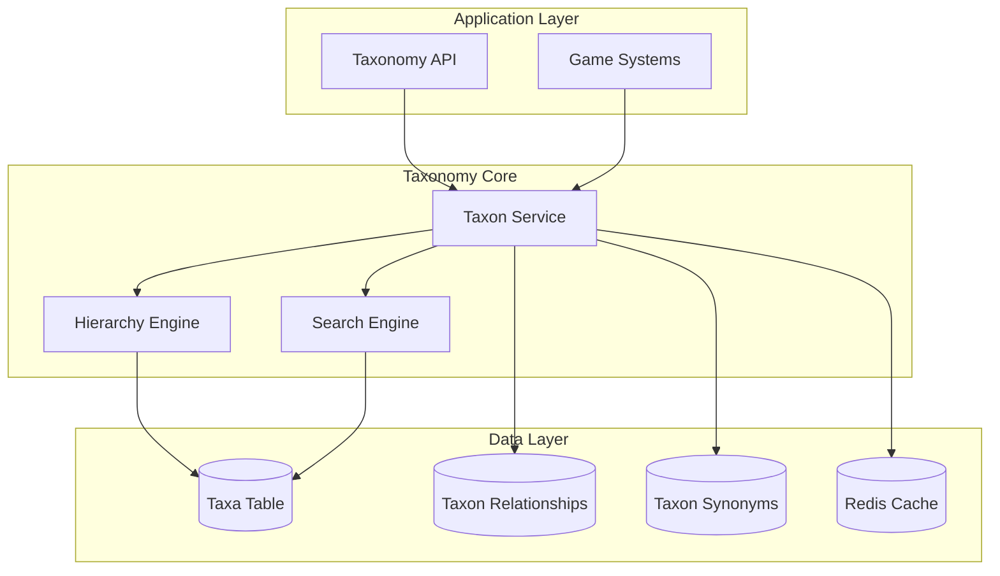

## Taxonomy Domains

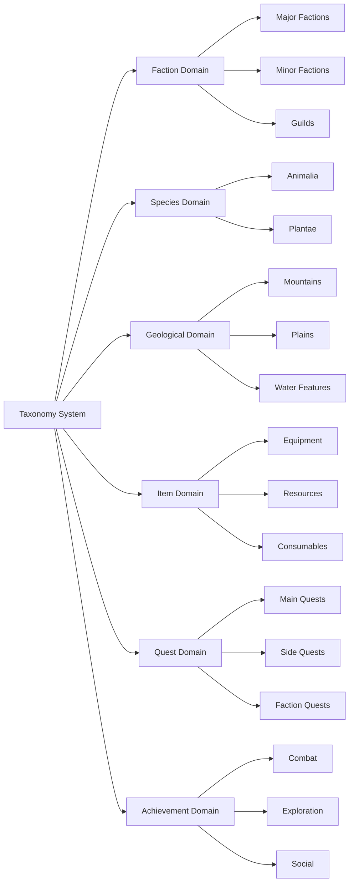

## Faction Hierarchy Example

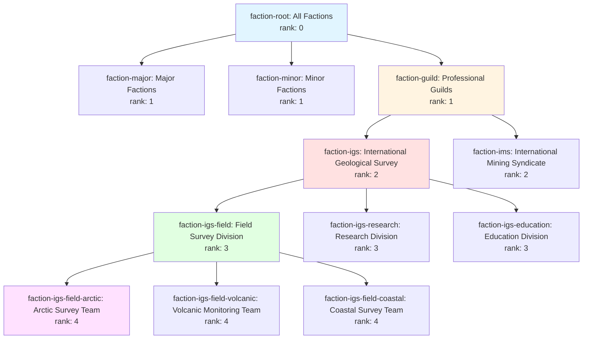

## Species Taxonomy Example

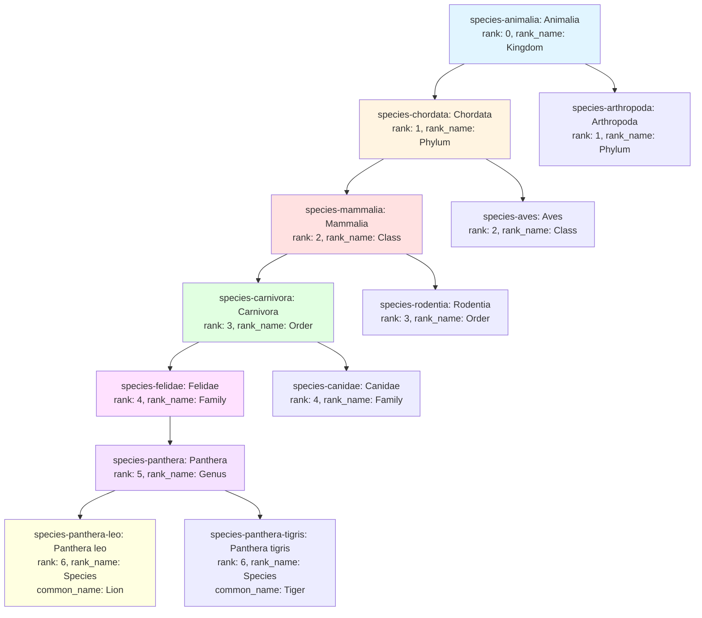

## Data Model Relationships

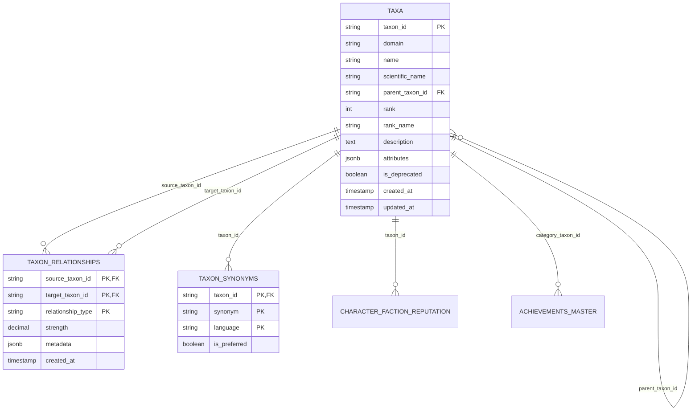

## API Request Flow

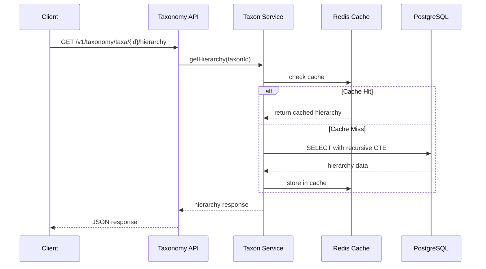

## Query Patterns

### Ancestor Query Flow

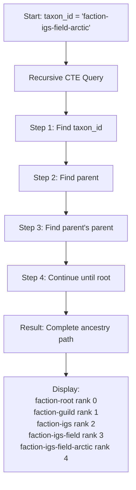

### Descendant Query Flow

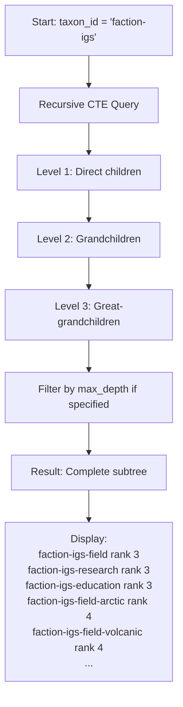

## Integration with Game Systems

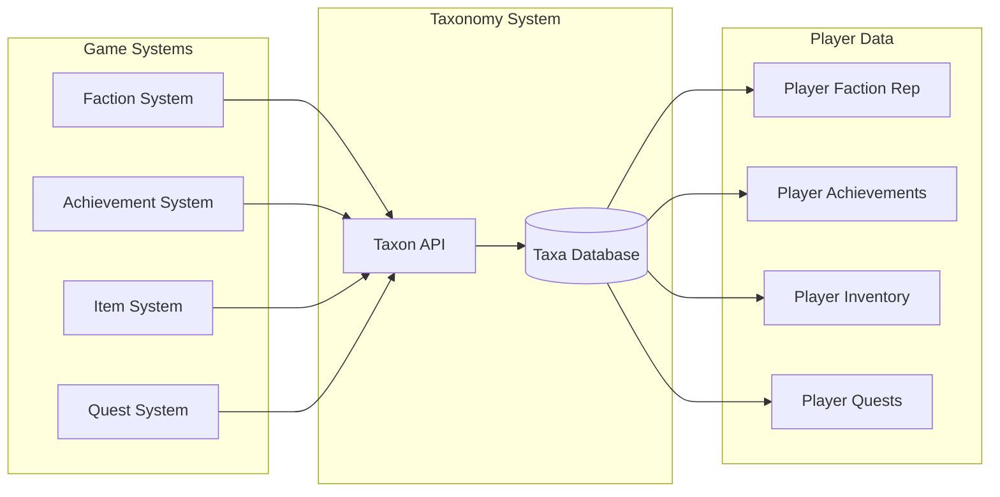

## Migration Strategy

```mermaid
graph LR
    subgraph "Phase 1: Setup"
        Create[Create Taxa Tables]
        Index[Create Indexes]
    end
    
    subgraph "Phase 2: Data Migration"
        Root[Create Root Taxa]
        Categories[Create Categories]
        Migrate[Migrate Existing Data]
    end
    
    subgraph "Phase 3: Application Update"
        UpdateCode[Update Application Code]
        UpdateAPI[Deploy New API]
        UpdateDB[Add Foreign Keys]
    end
    
    subgraph "Phase 4: Validation"
        Test[Test Queries]
        Verify[Verify Data Integrity]
        Monitor[Monitor Performance]
    end
    
    subgraph "Phase 5: Cleanup"
        Deprecate[Deprecate Old Tables]
        Document[Update Documentation]
    end
    
    Create --> Index
    Index --> Root
    Root --> Categories
    Categories --> Migrate
    Migrate --> UpdateCode
    UpdateCode --> UpdateAPI
    UpdateAPI --> UpdateDB
    UpdateDB --> Test
    Test --> Verify
    Verify --> Monitor
    Monitor --> Deprecate
    Deprecate --> Document
```

## Performance Optimization

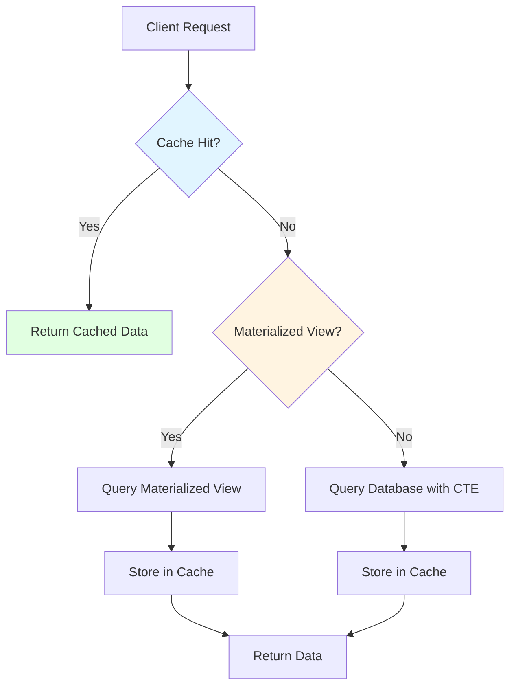

## Taxon Attributes Structure

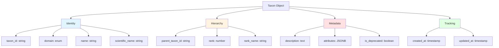

## Use Case: Player Joining Faction

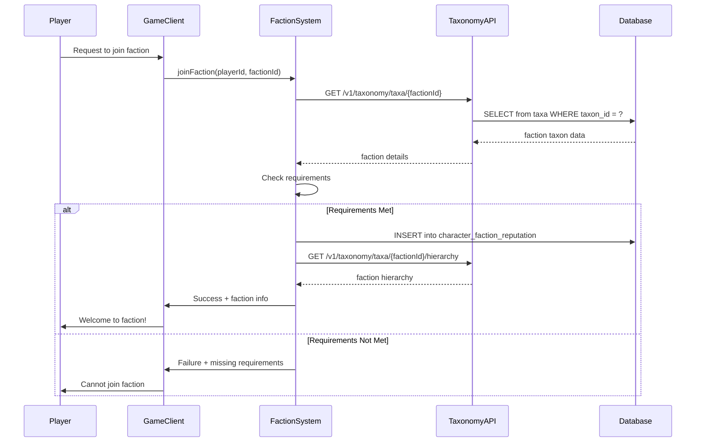

## Summary

This architecture provides:

- **Flexibility**: Domain-agnostic taxonomy system
- **Scalability**: Efficient hierarchical queries with caching
- **Extensibility**: New domains and taxa without schema changes
- **Performance**: Optimized with indexes, caching, and materialized views
- **Integration**: Clean API for all game systems

## Related Documentation

- [Taxonomy Classification System](taxonomy-classification-system.md) - Core design
- [Taxonomy API](api-taxonomy-system.md) - API specification
- [Taxonomy Usage Examples](taxonomy-usage-examples.md) - Practical examples
- [Taxonomy Migration Guide](taxonomy-migration-guide.md) - Migration process
