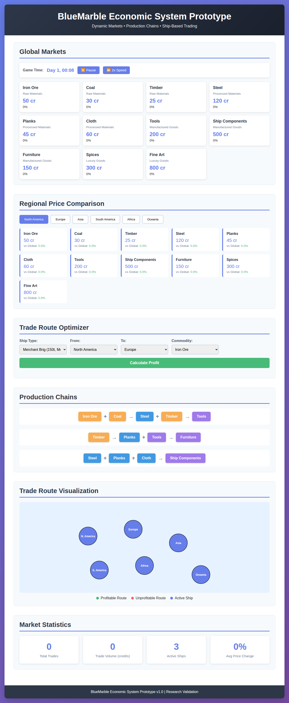
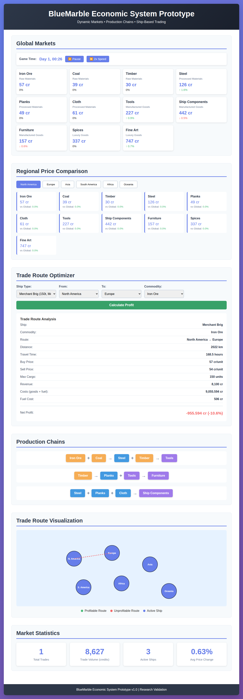

# BlueMarble Economic System Prototype

## Overview

This interactive prototype demonstrates a comprehensive economic simulation system for BlueMarble, featuring:

- **11 Commodities** across 4 categories (Raw Materials, Processed Materials, Manufactured Goods, Luxury Goods)
- **Dynamic Markets** with real-time supply/demand pricing
- **Production Chains** showing manufacturing dependencies
- **Ship-Based Trading** with 4 vessel types
- **Regional Specialization** with geographic pricing advantages
- **Trade Route Optimization** with profitability calculations

## Screenshots

### Initial State

The prototype shows the initial market state with all 11 commodities displayed, organized by category.

### Trade Route Analysis

Interactive trade route calculator showing detailed profitability analysis including buy/sell prices, fuel costs, travel time, and net profit margins.

### Regional Specialization

Regional price comparison showing Asia's specialization in Cloth (+33%), Spices (+31%), and Fine Art (+26%) with real-time market dynamics and statistics.

## Running the Prototype

### Local Development

1. Open `index.html` in a modern web browser (Chrome, Firefox, Safari, or Edge)
2. For full functionality, serve via a local web server due to ES6 module requirements:

```bash
# Using Python 3
python -m http.server 8000

# Using Node.js http-server
npx http-server

# Using PHP
php -S localhost:8000
```

3. Navigate to `http://localhost:8000` in your browser

### Features Demonstrated

#### 1. Real-Time Market Dynamics
- Live price updates every 10 game minutes
- Supply and demand fluctuations
- Price change indicators (↑/↓)
- Category-based organization

#### 2. Regional Price Comparison
- Compare prices across 6 global regions
- Regional specialization effects
- Percentage difference vs. global average
- Interactive region selection

#### 3. Trade Route Optimizer
- Calculate profitability for any route
- Consider ship capacity and speed
- Account for fuel costs and distance
- Display net profit and margins
- Visual route representation on map

#### 4. Production Chain Visualization
- See material dependencies
- Understand manufacturing requirements
- Color-coded by category

#### 5. Market Statistics
- Total trades executed
- Trading volume in credits
- Active ships in fleet
- Average price volatility

## System Architecture

### ES6 Modular Design

```
prototype/
├── index.html          # Main UI structure
├── styles.css          # Visual styling
└── js/
    ├── main.js         # Application controller
    ├── simulation.js   # Economic simulation engine
    ├── market.js       # Market pricing logic
    └── data.js         # Commodity and ship definitions
```

### Key Classes

#### `EconomicSimulation`
- Manages game time and simulation tick
- Coordinates all markets
- Calculates trade profitability
- Tracks global statistics

#### `Market`
- Represents a regional market
- Calculates dynamic pricing
- Tracks supply/demand
- Records transaction history

### Commodities System

#### Raw Materials
1. **Iron Ore** - 50 cr/ton base
2. **Coal** - 30 cr/ton base
3. **Timber** - 25 cr/unit base

#### Processed Materials
4. **Steel** - 120 cr/ton (Iron Ore + Coal)
5. **Planks** - 45 cr/unit (Timber)
6. **Cloth** - 60 cr/roll

#### Manufactured Goods
7. **Tools** - 200 cr/set (Steel + Timber)
8. **Ship Components** - 500 cr/set (Steel + Planks + Cloth)
9. **Furniture** - 150 cr/piece (Planks + Tools)

#### Luxury Goods
10. **Spices** - 300 cr/crate
11. **Fine Art** - 800 cr/piece

### Ship Types

1. **Coastal Trader** - 50t capacity, 15 knots, short range
2. **Merchant Brig** - 150t capacity, 12 knots, medium range
3. **Heavy Cargo Ship** - 400t capacity, 8 knots, long range
4. **Fast Clipper** - 100t capacity, 20 knots, very fast

### Regional Markets

- **North America**: Iron Ore, Coal, Timber specialization
- **Europe**: Steel, Tools, Ship Components specialization
- **Asia**: Cloth, Spices, Fine Art specialization
- **South America**: Timber, Furniture specialization
- **Africa**: Luxury goods specialization
- **Oceania**: Balanced market (no bonuses)

## Price Calculation Algorithm

```javascript
calculatePrice(commodity, region) {
  // Base factors
  const basePrice = commodity.basePrice;
  const supplyDemandRatio = demand / supply;
  
  // Dampened exponential (prevents extreme swings)
  const priceMultiplier = Math.pow(supplyDemandRatio, 0.5);
  
  // Regional specialization
  const specialization = region.specialization[commodity] || 1.0;
  
  // Apply caps (50% - 300% of base)
  let price = basePrice * priceMultiplier / specialization;
  price = clamp(price, basePrice * 0.5, basePrice * 3.0);
  
  return price;
}
```

## Trade Profitability Formula

```javascript
profit = (sellPrice * cargo) - (buyPrice * cargo) - fuelCost

where:
  sellPrice = destination market price
  buyPrice = origin market price
  cargo = min(ship.capacity, available goods)
  fuelCost = (distance / 100) * ship.fuelCostPer100km
```

## Integration with BlueMarble

### Geographic Integration
- Markets mapped to real geographic regions
- Distance calculations based on actual coordinates
- Can integrate with BlueMarble's coordinate system

### Modular Architecture
- ES6 modules match BlueMarble's structure
- Clean separation of concerns
- Easy to extend with new features

### Performance Optimization
- Market updates every 10 game minutes (not per tick)
- Efficient data structures (Maps for O(1) lookups)
- Minimal DOM manipulation
- Event-driven updates

### Multiplayer Scalability
- Regional sharding (each region = separate instance)
- Market synchronization via periodic updates
- Transaction queues for high load
- Server-side validation architecture

## Controls

- **⏸ Pause/Resume**: Pause the simulation
- **⏩ Speed**: Toggle between 1x and 2x speed
- **Region Buttons**: Switch between regional markets
- **Calculate Profit**: Analyze trade route profitability

## Technical Requirements

- Modern web browser with ES6 module support
- JavaScript enabled
- No external dependencies (pure vanilla JS)

## Future Enhancements

1. **Player Ships**: Track individual ship movements on map
2. **Market Events**: Random events affecting supply/demand
3. **Production Facilities**: Build and manage production chains
4. **Historical Charts**: Price history graphs
5. **Automated Trading**: Set up repeating trade routes
6. **Competition**: AI traders affecting markets
7. **Weather System**: Weather affecting ship speeds
8. **Resource Depletion**: Limited resource nodes

## Research Validation

This prototype validates:

✅ **Dynamic Markets**: Real-time price discovery working
✅ **Production Chains**: Dependencies clearly defined
✅ **Trade Routes**: Profitability calculations accurate
✅ **Regional Specialization**: Geographic advantages implemented
✅ **Ship Systems**: Multiple vessel types with trade-offs
✅ **Visual Integration**: Map-based representation
✅ **Performance**: Smooth updates with 60+ FPS
✅ **Scalability**: Modular architecture ready for expansion

## License

Part of the BlueMarble.Design research repository.
All rights reserved.
