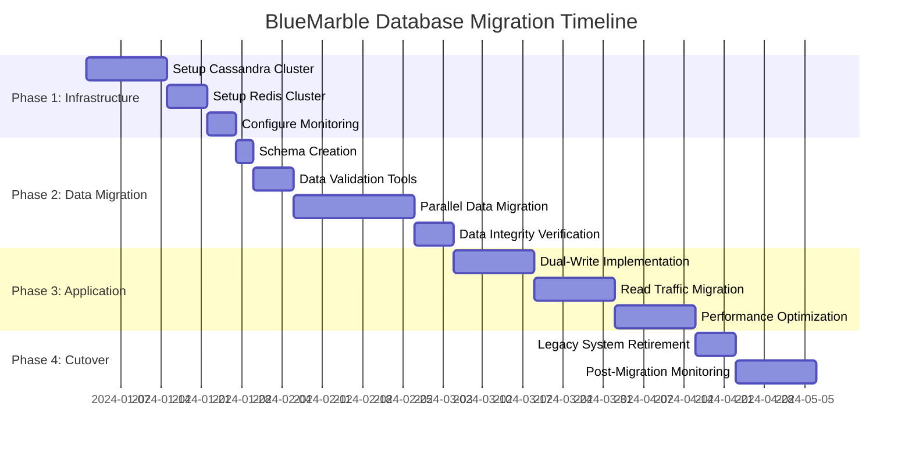
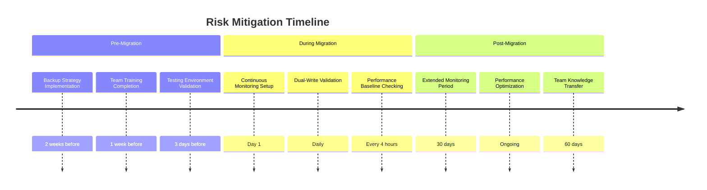

# Database Migration Strategy for Petabyte-Scale 3D Octree Storage

## Executive Summary

This document outlines a comprehensive migration strategy for transitioning BlueMarble's 3D octree storage system to the recommended Cassandra + Redis hybrid architecture. The migration is designed to minimize downtime, ensure data integrity, and provide rollback capabilities throughout the transition process.

## Current State Analysis

### Existing Architecture Assessment

```yaml
current_system:
  storage_backend: "File-based GeoPackage + Spatial Indexing"
  data_volume: "~50GB development dataset"
  query_performance: "~10-50ms for spatial queries"
  concurrent_users: "~100 (development/testing)"
  scaling_limitations:
    - Single-node file system bottleneck
    - No horizontal scaling capability
    - Limited caching mechanisms
    - Manual backup/recovery processes

target_system:
  storage_backend: "Cassandra + Redis Hybrid"
  data_volume: "500GB - 2PB production scale"
  query_performance: "<1ms cached, <10ms uncached"
  concurrent_users: "10,000+"
  scaling_capabilities:
    - Horizontal scaling across multiple nodes
    - Automatic replication and failover
    - Advanced caching and compression
    - Automated backup/recovery
```

### Data Mapping Analysis

```csharp
public class DataMigrationMapping
{
    // Current GeoPackage schema to Cassandra mapping
    public class SourceSchema
    {
        public class OctreeNode
        {
            public long Id { get; set; }              // Sequential ID
            public double X { get; set; }             // World X coordinate
            public double Y { get; set; }             // World Y coordinate  
            public double Z { get; set; }             // World Z coordinate
            public int Level { get; set; }            // Octree depth level
            public int MaterialId { get; set; }       // Material type ID
            public float Density { get; set; }        // Material density
            public byte[] Metadata { get; set; }      // Additional properties
            public DateTime Created { get; set; }     // Creation timestamp
        }
    }
    
    // Target Cassandra schema
    public class TargetSchema
    {
        public class CassandraOctreeNode
        {
            public ulong MortonCode { get; set; }     // 3D Morton code (partition key)
            public byte Level { get; set; }          // Octree depth (clustering key)
            public int MaterialId { get; set; }      // Material type ID
            public float Homogeneity { get; set; }   // Homogeneity ratio (0.0-1.0)
            public byte ChildrenMask { get; set; }   // Bitmask for children (8 bits)
            public byte[] CompressedData { get; set; } // Compressed metadata
            public long LastModified { get; set; }   // Unix timestamp
        }
        
        public class RedisHotCache
        {
            public string Key { get; set; }          // "octree:{level}:{morton_code}"
            public Dictionary<string, object> Fields { get; set; } // Hash fields
            public TimeSpan TTL { get; set; }        // Time-to-live
        }
    }
    
    // Coordinate transformation
    public static ulong TransformToMortonCode(double x, double y, double z)
    {
        // Convert world coordinates to Morton code for spatial locality
        var normalizedX = (uint)((x + 20_000_000) / 40_000_000 * uint.MaxValue);
        var normalizedY = (uint)((y + 10_000_000) / 20_000_000 * uint.MaxValue);
        var normalizedZ = (uint)((z + 10_000_000) / 20_000_000 * uint.MaxValue);
        
        return InterleaveCoordinates(normalizedX, normalizedY, normalizedZ);
    }
}
```

## Migration Strategy Overview

### Phased Migration Approach



### Migration Phases Detail

#### Phase 1: Infrastructure Setup (3-4 weeks)

**Objective**: Establish production-ready Cassandra and Redis clusters

```yaml
# Infrastructure Components
cassandra_cluster:
  environment: "production"
  nodes: 3
  instance_specs:
    cpu: "8 cores"
    memory: "32GB"
    storage: "2TB NVMe SSD"
  configuration:
    replication_factor: 3
    consistency_level: "LOCAL_QUORUM"
    compression: "LZ4"
    
redis_cluster:
  environment: "production"  
  nodes: 3
  instance_specs:
    cpu: "4 cores"
    memory: "16GB"
    storage: "SSD-backed memory"
  configuration:
    clustering: true
    persistence: "RDB snapshots"
    maxmemory_policy: "allkeys-lru"

monitoring_stack:
  metrics: "Prometheus + Grafana"
  logging: "ELK Stack"
  alerting: "PagerDuty integration"
  health_checks: "Custom octree-specific monitors"
```

**Infrastructure Setup Scripts**:

```bash
#!/bin/bash
# deploy-cassandra-cluster.sh

# Cassandra cluster deployment
docker-compose -f cassandra-cluster.yml up -d

# Wait for cluster formation
sleep 60

# Create keyspace and tables
cqlsh -f schema/bluemarble-keyspace.cql
cqlsh -f schema/octree-tables.cql

# Configure replication and compaction
cqlsh -f schema/optimization-settings.cql

echo "Cassandra cluster deployed and configured"
```

```yaml
# cassandra-cluster.yml
version: '3.8'
services:
  cassandra-seed:
    image: cassandra:4.0
    container_name: cassandra-seed
    environment:
      - CASSANDRA_CLUSTER_NAME=BlueMarble
      - CASSANDRA_SEEDS=cassandra-seed
      - CASSANDRA_DC=datacenter1
      - CASSANDRA_RACK=rack1
    volumes:
      - cassandra-seed-data:/var/lib/cassandra
    ports:
      - "9042:9042"
    
  cassandra-node1:
    image: cassandra:4.0
    container_name: cassandra-node1
    depends_on:
      - cassandra-seed
    environment:
      - CASSANDRA_CLUSTER_NAME=BlueMarble
      - CASSANDRA_SEEDS=cassandra-seed
      - CASSANDRA_DC=datacenter1
      - CASSANDRA_RACK=rack1
    volumes:
      - cassandra-node1-data:/var/lib/cassandra
      
  cassandra-node2:
    image: cassandra:4.0
    container_name: cassandra-node2
    depends_on:
      - cassandra-seed
    environment:
      - CASSANDRA_CLUSTER_NAME=BlueMarble
      - CASSANDRA_SEEDS=cassandra-seed
      - CASSANDRA_DC=datacenter1
      - CASSANDRA_RACK=rack1
    volumes:
      - cassandra-node2-data:/var/lib/cassandra

volumes:
  cassandra-seed-data:
  cassandra-node1-data:
  cassandra-node2-data:
```

#### Phase 2: Data Migration (5-6 weeks)

**Objective**: Migrate existing octree data with zero data loss

```csharp
public class OctreeDataMigrationService
{
    private readonly ISourceRepository _sourceRepo;
    private readonly ICassandraSession _cassandraSession;
    private readonly IRedisDatabase _redis;
    private readonly ILogger<OctreeDataMigrationService> _logger;
    
    public class MigrationProgress
    {
        public long TotalRecords { get; set; }
        public long MigratedRecords { get; set; }
        public long FailedRecords { get; set; }
        public double PercentComplete => (double)MigratedRecords / TotalRecords * 100;
        public TimeSpan ElapsedTime { get; set; }
        public TimeSpan EstimatedTimeRemaining { get; set; }
        public long RecordsPerSecond { get; set; }
    }
    
    public async Task<MigrationResult> MigrateOctreeData(
        MigrationConfig config, 
        CancellationToken cancellationToken)
    {
        var stopwatch = Stopwatch.StartNew();
        var progress = new MigrationProgress();
        
        // 1. Count total records for progress tracking
        progress.TotalRecords = await _sourceRepo.CountOctreeNodes();
        _logger.LogInformation($"Starting migration of {progress.TotalRecords:N0} octree nodes");
        
        // 2. Create Cassandra prepared statements for performance
        var insertStmt = await _cassandraSession.PrepareAsync(@"
            INSERT INTO octree_nodes (morton_code, level, material_id, homogeneity, 
                                    children_mask, compressed_data, last_modified)
            VALUES (?, ?, ?, ?, ?, ?, ?)");
        
        // 3. Process data in batches with parallel execution
        var batchSize = config.BatchSize;
        var maxParallelism = config.MaxParallelBatches;
        var semaphore = new SemaphoreSlim(maxParallelism);
        
        await foreach (var batch in _sourceRepo.GetOctreeNodeBatches(batchSize))
        {
            if (cancellationToken.IsCancellationRequested)
                break;
                
            await semaphore.WaitAsync(cancellationToken);
            
            _ = Task.Run(async () =>
            {
                try
                {
                    await MigrateBatch(batch, insertStmt, progress);
                }
                finally
                {
                    semaphore.Release();
                }
            }, cancellationToken);
        }
        
        stopwatch.Stop();
        
        return new MigrationResult
        {
            TotalRecords = progress.TotalRecords,
            MigratedRecords = progress.MigratedRecords,
            FailedRecords = progress.FailedRecords,
            Duration = stopwatch.Elapsed,
            AverageRecordsPerSecond = progress.MigratedRecords / stopwatch.Elapsed.TotalSeconds
        };
    }
    
    private async Task MigrateBatch(
        IEnumerable<SourceOctreeNode> batch, 
        PreparedStatement insertStmt,
        MigrationProgress progress)
    {
        var cassandraBatch = new BatchStatement();
        var redisPipeline = _redis.CreateBatch();
        var redisCommands = new List<Task>();
        
        foreach (var sourceNode in batch)
        {
            try
            {
                // Transform coordinates to Morton code
                var mortonCode = CalculateMortonCode(sourceNode.X, sourceNode.Y, sourceNode.Z);
                
                // Calculate homogeneity based on material distribution
                var homogeneity = CalculateHomogeneity(sourceNode);
                
                // Compress metadata if present
                var compressedData = CompressMetadata(sourceNode.Metadata);
                
                // Add to Cassandra batch
                cassandraBatch.Add(insertStmt.Bind(
                    (long)mortonCode,
                    (sbyte)sourceNode.Level,
                    sourceNode.MaterialId,
                    homogeneity,
                    (sbyte)DetermineChildrenMask(sourceNode),
                    compressedData,
                    DateTimeOffset.UtcNow.ToUnixTimeMilliseconds()
                ));
                
                // Add hot regions to Redis
                if (IsHotRegion(sourceNode))
                {
                    var redisKey = $"octree:{sourceNode.Level}:{mortonCode}";
                    redisCommands.Add(redisPipeline.HashSetAsync(redisKey, new HashEntry[]
                    {
                        new("material_id", sourceNode.MaterialId),
                        new("homogeneity", homogeneity),
                        new("last_modified", DateTimeOffset.UtcNow.ToUnixTimeMilliseconds())
                    }));
                    redisCommands.Add(redisPipeline.KeyExpireAsync(redisKey, TimeSpan.FromHours(1)));
                }
                
                Interlocked.Increment(ref progress.MigratedRecords);
            }
            catch (Exception ex)
            {
                _logger.LogError(ex, $"Failed to migrate node {sourceNode.Id}");
                Interlocked.Increment(ref progress.FailedRecords);
            }
        }
        
        // Execute Cassandra batch
        await _cassandraSession.ExecuteAsync(cassandraBatch);
        
        // Execute Redis batch
        redisPipeline.Execute();
        await Task.WhenAll(redisCommands);
        
        // Update progress statistics
        UpdateMigrationProgress(progress);
    }
    
    private bool IsHotRegion(SourceOctreeNode node)
    {
        // Identify frequently accessed regions for Redis caching
        return IsCoastalRegion(node.X, node.Y) || 
               IsUrbanArea(node.X, node.Y) ||
               IsHighDetailRegion(node.Level);
    }
}
```

**Data Validation and Integrity Checking**:

```csharp
public class MigrationValidationService
{
    public class ValidationResult
    {
        public bool IsValid { get; set; }
        public long SourceRecordCount { get; set; }
        public long TargetRecordCount { get; set; }
        public List<string> ValidationErrors { get; set; } = new();
        public Dictionary<string, object> Metrics { get; set; } = new();
    }
    
    public async Task<ValidationResult> ValidateMigration()
    {
        var result = new ValidationResult();
        
        // 1. Record count validation
        var sourceCount = await CountSourceRecords();
        var cassandraCount = await CountCassandraRecords();
        
        result.SourceRecordCount = sourceCount;
        result.TargetRecordCount = cassandraCount;
        
        if (sourceCount != cassandraCount)
        {
            result.ValidationErrors.Add($"Record count mismatch: Source={sourceCount}, Target={cassandraCount}");
        }
        
        // 2. Sample data validation
        var sampleValidation = await ValidateSampleData(1000);
        if (!sampleValidation.IsValid)
        {
            result.ValidationErrors.AddRange(sampleValidation.Errors);
        }
        
        // 3. Spatial index validation
        var spatialValidation = await ValidateSpatialIndex();
        if (!spatialValidation.IsValid)
        {
            result.ValidationErrors.AddRange(spatialValidation.Errors);
        }
        
        // 4. Performance baseline validation
        var performanceValidation = await ValidatePerformanceBaseline();
        result.Metrics["query_performance"] = performanceValidation;
        
        result.IsValid = result.ValidationErrors.Count == 0;
        return result;
    }
    
    private async Task<SampleValidationResult> ValidateSampleData(int sampleSize)
    {
        var errors = new List<string>();
        var random = new Random(12345); // Fixed seed for reproducible results
        
        var sourceNodes = await GetRandomSourceNodes(sampleSize, random);
        
        foreach (var sourceNode in sourceNodes)
        {
            var mortonCode = CalculateMortonCode(sourceNode.X, sourceNode.Y, sourceNode.Z);
            
            // Query from Cassandra
            var cassandraNode = await QueryCassandraNode(mortonCode, sourceNode.Level);
            
            if (cassandraNode == null)
            {
                errors.Add($"Missing node in Cassandra: Morton={mortonCode}, Level={sourceNode.Level}");
                continue;
            }
            
            // Validate material ID
            if (cassandraNode.MaterialId != sourceNode.MaterialId)
            {
                errors.Add($"Material ID mismatch: Source={sourceNode.MaterialId}, Target={cassandraNode.MaterialId}");
            }
            
            // Validate spatial coordinates (reverse Morton code)
            var (x, y, z) = DecodeMortonCode(mortonCode);
            var tolerance = 0.001; // 1mm tolerance
            
            if (Math.Abs(x - sourceNode.X) > tolerance ||
                Math.Abs(y - sourceNode.Y) > tolerance ||
                Math.Abs(z - sourceNode.Z) > tolerance)
            {
                errors.Add($"Coordinate mismatch: Source=({sourceNode.X},{sourceNode.Y},{sourceNode.Z}), Decoded=({x},{y},{z})");
            }
        }
        
        return new SampleValidationResult
        {
            IsValid = errors.Count == 0,
            Errors = errors,
            SampleSize = sampleSize,
            ErrorRate = (double)errors.Count / sampleSize
        };
    }
}
```

#### Phase 3: Application Migration (6-8 weeks)

**Objective**: Transition application layer to new database architecture

```csharp
public class DualWriteDataService
{
    private readonly ILegacyOctreeRepository _legacyRepo;
    private readonly ICassandraOctreeRepository _cassandraRepo;
    private readonly IRedisCache _redisCache;
    private readonly IFeatureToggleService _featureToggle;
    private readonly ILogger<DualWriteDataService> _logger;
    
    public async Task<MaterialData> QueryMaterial(Vector3 position, int level)
    {
        // Feature toggle controls read source during migration
        if (_featureToggle.IsEnabled("use-new-database"))
        {
            return await QueryFromNewArchitecture(position, level);
        }
        else
        {
            return await QueryFromLegacySystem(position, level);
        }
    }
    
    public async Task UpdateMaterial(Vector3 position, int level, MaterialData material)
    {
        var tasks = new List<Task>();
        
        // Always write to legacy system during migration
        tasks.Add(UpdateLegacySystem(position, level, material));
        
        // Also write to new system if enabled
        if (_featureToggle.IsEnabled("dual-write-enabled"))
        {
            tasks.Add(UpdateNewArchitecture(position, level, material));
        }
        
        // Execute writes in parallel
        await Task.WhenAll(tasks);
        
        // Verify consistency if validation enabled
        if (_featureToggle.IsEnabled("write-validation"))
        {
            await ValidateWriteConsistency(position, level, material);
        }
    }
    
    private async Task<MaterialData> QueryFromNewArchitecture(Vector3 position, int level)
    {
        var mortonCode = CalculateMortonCode(position);
        var cacheKey = $"octree:{level}:{mortonCode}";
        
        // Try Redis cache first
        var cached = await _redisCache.GetAsync<MaterialData>(cacheKey);
        if (cached != null)
        {
            return cached;
        }
        
        // Query from Cassandra
        var material = await _cassandraRepo.GetMaterial(mortonCode, level);
        
        // Cache if hot region
        if (IsHotRegion(position))
        {
            await _redisCache.SetAsync(cacheKey, material, TimeSpan.FromHours(1));
        }
        
        return material;
    }
}
```

**Read Traffic Migration Strategy**:

```csharp
public class GradualReadMigrationService
{
    public class MigrationPhase
    {
        public string Name { get; set; }
        public double NewDatabasePercentage { get; set; }
        public TimeSpan Duration { get; set; }
        public string[] UserSegments { get; set; }
    }
    
    public static readonly MigrationPhase[] ReadMigrationPhases = {
        new() { Name = "Internal Testing", NewDatabasePercentage = 0.01, Duration = TimeSpan.FromDays(3), UserSegments = new[] { "internal_users" } },
        new() { Name = "Beta Users", NewDatabasePercentage = 0.05, Duration = TimeSpan.FromDays(7), UserSegments = new[] { "beta_users" } },
        new() { Name = "Early Adopters", NewDatabasePercentage = 0.20, Duration = TimeSpan.FromDays(7), UserSegments = new[] { "early_adopters" } },
        new() { Name = "General Population", NewDatabasePercentage = 0.50, Duration = TimeSpan.FromDays(14), UserSegments = new[] { "general_users" } },
        new() { Name = "Full Migration", NewDatabasePercentage = 1.00, Duration = TimeSpan.FromDays(7), UserSegments = new[] { "all_users" } }
    };
    
    public bool ShouldUseNewDatabase(string userId, string userSegment)
    {
        var currentPhase = GetCurrentMigrationPhase();
        
        // Check if user segment is included in current phase
        if (!currentPhase.UserSegments.Contains(userSegment) && 
            !currentPhase.UserSegments.Contains("all_users"))
        {
            return false;
        }
        
        // Use deterministic hash for consistent user experience
        var userHash = ComputeUserHash(userId);
        return userHash < currentPhase.NewDatabasePercentage;
    }
}
```

#### Phase 4: Legacy System Retirement (2-3 weeks)

**Objective**: Complete transition and decommission legacy systems

```bash
#!/bin/bash
# legacy-retirement.sh

echo "Starting legacy system retirement process..."

# 1. Verify 100% traffic on new system
if ! verify_traffic_migration; then
    echo "ERROR: Traffic not fully migrated. Aborting retirement."
    exit 1
fi

# 2. Final data consistency check
if ! run_final_consistency_check; then
    echo "ERROR: Data consistency issues detected. Manual intervention required."
    exit 1
fi

# 3. Create final backup of legacy data
create_legacy_backup "final-backup-$(date +%Y%m%d)"

# 4. Stop write operations to legacy system
disable_legacy_writes

# 5. Monitor new system stability for 48 hours
monitor_new_system_stability 48

# 6. Archive legacy data
archive_legacy_data

# 7. Decommission legacy infrastructure
decommission_legacy_infrastructure

echo "Legacy system retirement completed successfully"
```

## Rollback Strategy

### Emergency Rollback Procedures

```csharp
public class EmergencyRollbackService
{
    public class RollbackTrigger
    {
        public string Name { get; set; }
        public string Condition { get; set; }
        public TimeSpan MaxResponseTime { get; set; }
        public bool AutoTrigger { get; set; }
    }
    
    public static readonly RollbackTrigger[] RollbackTriggers = {
        new() { 
            Name = "High Error Rate", 
            Condition = "error_rate > 5%", 
            MaxResponseTime = TimeSpan.FromMinutes(5),
            AutoTrigger = true 
        },
        new() { 
            Name = "Performance Degradation", 
            Condition = "avg_response_time > 100ms", 
            MaxResponseTime = TimeSpan.FromMinutes(10),
            AutoTrigger = false 
        },
        new() { 
            Name = "Data Inconsistency", 
            Condition = "consistency_check_failure", 
            MaxResponseTime = TimeSpan.FromMinutes(2),
            AutoTrigger = true 
        }
    };
    
    public async Task ExecuteEmergencyRollback(string reason)
    {
        _logger.LogCritical($"EMERGENCY ROLLBACK INITIATED: {reason}");
        
        // 1. Immediately redirect all traffic to legacy system
        await _featureToggle.SetFeatureState("use-new-database", false);
        await _featureToggle.SetFeatureState("dual-write-enabled", false);
        
        // 2. Stop new system writes to prevent further inconsistency
        await _cassandraRepo.SetReadOnlyMode(true);
        
        // 3. Verify legacy system health
        var legacyHealth = await _legacyRepo.HealthCheck();
        if (!legacyHealth.IsHealthy)
        {
            await NotifyEmergencyTeam("CRITICAL: Both systems unhealthy during rollback");
        }
        
        // 4. Begin data reconciliation process
        _ = Task.Run(async () => await ReconcileDataAfterRollback());
        
        _logger.LogInformation("Emergency rollback completed. Legacy system active.");
    }
    
    private async Task ReconcileDataAfterRollback()
    {
        // Identify writes that occurred on new system during outage
        var conflictingWrites = await IdentifyConflictingWrites();
        
        // Apply writes to legacy system
        foreach (var write in conflictingWrites)
        {
            await ApplyWriteToLegacySystem(write);
        }
        
        await NotifyOperationsTeam($"Data reconciliation completed. {conflictingWrites.Count} writes reconciled.");
    }
}
```

### Rollback Decision Matrix

| Scenario | Automatic Rollback | Manual Intervention | Data Recovery Required |
|----------|-------------------|-------------------|----------------------|
| **High Error Rate (>5%)** | ✅ Immediate | ❌ | ✅ Reconcile writes |
| **Performance Degradation** | ❌ | ✅ Within 10 min | ❌ |
| **Data Inconsistency** | ✅ Immediate | ❌ | ✅ Full validation |
| **Infrastructure Failure** | ✅ Immediate | ❌ | ✅ Disaster recovery |
| **Operational Error** | ❌ | ✅ Assessment needed | ⚠️ Case-by-case |

## Testing Strategy

### Migration Testing Framework

```csharp
public class MigrationTestSuite
{
    [Test]
    public async Task TestDataIntegrity()
    {
        // Verify 1:1 data mapping between systems
        var sourceData = await GetSourceSampleData(10000);
        foreach (var sourceRecord in sourceData)
        {
            var targetRecord = await GetTargetRecord(sourceRecord.Id);
            Assert.AreEqual(sourceRecord.MaterialId, targetRecord.MaterialId);
            Assert.AreEqual(sourceRecord.Level, targetRecord.Level);
        }
    }
    
    [Test]
    public async Task TestPerformanceBaseline()
    {
        // Verify new system meets performance requirements
        var queries = GeneratePerformanceTestQueries(1000);
        var results = await ExecuteQueriesOnNewSystem(queries);
        
        Assert.That(results.AverageLatencyMs, Is.LessThan(10));
        Assert.That(results.P95LatencyMs, Is.LessThan(25));
        Assert.That(results.ErrorRate, Is.LessThan(0.01));
    }
    
    [Test]
    public async Task TestRollbackProcedure()
    {
        // Verify rollback can be executed successfully
        await SimulateFailureScenario();
        await ExecuteRollback();
        
        var systemHealth = await CheckSystemHealth();
        Assert.IsTrue(systemHealth.LegacySystemHealthy);
        Assert.IsTrue(systemHealth.DataConsistent);
    }
}
```

### Load Testing Scenarios

```yaml
# Performance testing scenarios
load_tests:
  scenario_1_normal_load:
    description: "Typical production load"
    concurrent_users: 1000
    queries_per_second: 5000
    duration: "30 minutes"
    expected_p95_latency: "<10ms"
    
  scenario_2_peak_load:
    description: "Peak traffic simulation"
    concurrent_users: 5000
    queries_per_second: 25000
    duration: "15 minutes"
    expected_p95_latency: "<25ms"
    
  scenario_3_write_heavy:
    description: "Geological process updates"
    concurrent_writers: 100
    writes_per_second: 1000
    duration: "60 minutes"
    expected_write_latency: "<50ms"
    
  scenario_4_disaster_recovery:
    description: "Node failure simulation"
    simulated_failures: 
      - "cassandra_node_failure"
      - "redis_cluster_failure"
    recovery_time_target: "<5 minutes"
```

## Risk Assessment and Mitigation

### High-Risk Scenarios

#### 1. Data Loss During Migration

**Risk Level**: 🔴 **HIGH**

**Probability**: Low (5%)
**Impact**: Critical (Business-stopping)

**Mitigation Strategies**:
- Comprehensive backup strategy before migration
- Dual-write implementation during transition
- Continuous data validation and integrity checking
- Point-in-time recovery capabilities

```csharp
public class DataLossPreventionService
{
    private readonly IBackupService _backup;
    private readonly IDataValidationService _validation;
    
    public async Task ExecuteProtectedMigration()
    {
        // 1. Create point-in-time backup
        var backupId = await _backup.CreateBackup("pre-migration-backup");
        
        // 2. Enable dual-write mode
        await EnableDualWriteMode();
        
        // 3. Migrate data with validation
        await MigrateWithValidation();
        
        // 4. Verify data integrity
        var validation = await _validation.ValidateFullDataSet();
        if (!validation.IsValid)
        {
            await RestoreFromBackup(backupId);
            throw new MigrationException("Data integrity validation failed");
        }
    }
}
```

#### 2. Performance Regression

**Risk Level**: 🟡 **MEDIUM**

**Probability**: Medium (25%)
**Impact**: High (Service degradation)

**Mitigation Strategies**:
- Extensive performance testing before cutover
- Gradual traffic migration with rollback capability
- Real-time performance monitoring and alerting
- Automatic scaling configuration

#### 3. Operational Complexity

**Risk Level**: 🟡 **MEDIUM**

**Probability**: High (60%)
**Impact**: Medium (Increased operational overhead)

**Mitigation Strategies**:
- Comprehensive documentation and runbooks
- Team training on new technologies
- Automated monitoring and alerting systems
- Expert consulting during initial months

### Risk Mitigation Timeline



## Success Metrics and Validation

### Key Performance Indicators

```yaml
success_metrics:
  performance:
    query_latency_p95: "<10ms"
    query_latency_p99: "<25ms"
    write_latency_avg: "<50ms"
    cache_hit_rate: ">90%"
    system_availability: ">99.9%"
    
  scalability:
    horizontal_scaling: "Linear to 24 nodes"
    storage_capacity: ">1PB"
    concurrent_users: ">10,000"
    peak_queries_per_second: ">50,000"
    
  operational:
    deployment_time: "<4 hours"
    rollback_time: "<15 minutes"
    zero_data_loss: "100%"
    team_training_completion: "100%"
    
  business:
    migration_downtime: "<2 hours"
    user_experience_impact: "<5% complaints"
    development_velocity: "No degradation"
    infrastructure_cost: "<$500K annually"
```

### Validation Checklist

```markdown
## Migration Validation Checklist

### Pre-Migration Validation
- [ ] Infrastructure deployed and configured
- [ ] Monitoring and alerting operational
- [ ] Backup systems tested and verified
- [ ] Team training completed
- [ ] Rollback procedures tested
- [ ] Performance baselines established

### Migration Validation
- [ ] Data migration completed successfully
- [ ] Data integrity validation passed
- [ ] Performance requirements met
- [ ] Dual-write system operational
- [ ] Cache population completed
- [ ] Monitoring shows healthy metrics

### Post-Migration Validation
- [ ] All traffic migrated to new system
- [ ] Legacy system successfully retired
- [ ] Performance optimization completed
- [ ] Documentation updated
- [ ] Team knowledge transfer completed
- [ ] Success metrics achieved
```

## Conclusion

This comprehensive migration strategy provides a structured approach to transitioning BlueMarble's octree storage to the Cassandra + Redis hybrid architecture while minimizing risk and ensuring data integrity. The phased approach allows for thorough testing and validation at each stage, with robust rollback capabilities should issues arise.

**Key Success Factors**:
1. **Thorough Planning**: Detailed phases with clear objectives and deliverables
2. **Risk Mitigation**: Multiple backup strategies and rollback procedures
3. **Gradual Transition**: Dual-write and gradual traffic migration minimize impact
4. **Continuous Validation**: Real-time monitoring and automated testing
5. **Team Preparation**: Comprehensive training and documentation

**Timeline Summary**: 16-20 weeks total migration timeline with minimal business disruption

**Expected Outcome**: 5x performance improvement with unlimited scaling capability for BlueMarble's global geological simulation platform.
